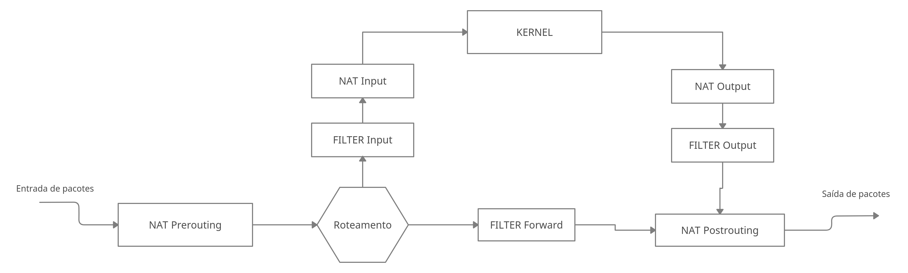
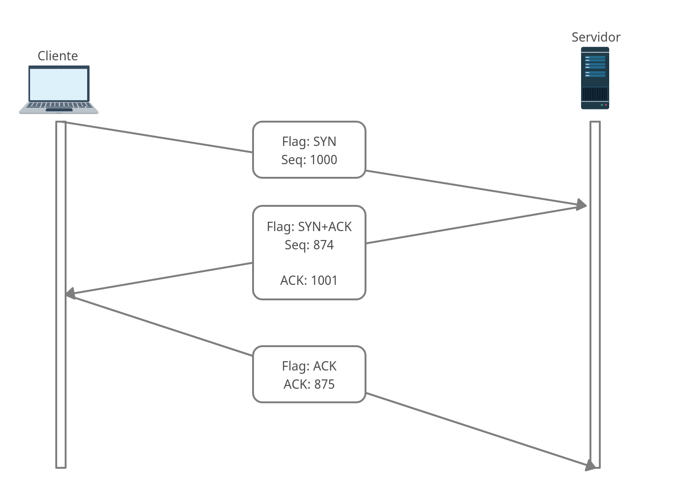
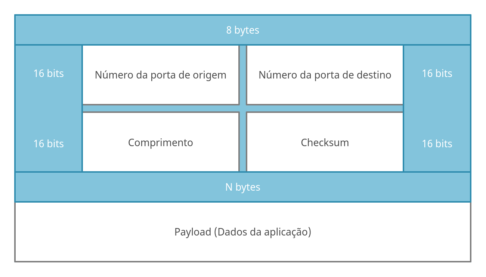
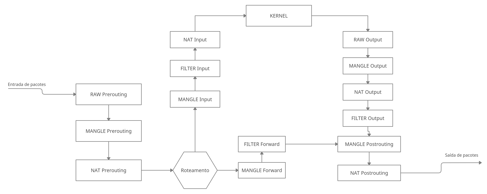

# Sumário

[Introdução](#Introdução)

[Gerações de Firewalls](#As-Gerações-de-Firewall)

[DMZ - Demilitarized Zone](DMZ---Demilitarized-Zone)

[Operações de um Firewall](#Operações-de-um-Firewall)

[IPTABLES](#IPTABLES)

​	[Tabelas](#Tabelas)

​	[Chains](Chains)

​	[Políticas e Regras](#Políticas-e-Regras)

​	[Opções do Iptables](#Opções-do-Iptables)

[Estrutura das definições de regras](#Estrutura-das-definições-de-regras)

[Construindo um Firewall](#Construindo-um-Firewall)

​	[Arquitetura Cliente e Servidor](#Arquitetura-Cliente-e-Servidor)

​	[TCP - Transmission Control Protocol](#TCP---Transmission-Control-Protocol)

​	[UDP - User Datagram Protocol](#UDP---User-Datagram-Protocol)

​	[ICMP - Protocolo de Mensagens de Controle da Internet](#ICMP---Protocolo-de-Mensagens-de-Controle-da-Internet)

​	[ICMPv6 - Internet Control Message Protocol versão 6](#ICMPv6---Internet-Control-Message-Protocol-versão-6)

​	[Portas](#Portas)

[Alterando uma regra existente](#Alterando-uma-regra-existente)

[Servidor de Internet (NAT)](#Servidor-de-Internet-(NAT))

​	[O que é NAT?](#O-que-é-NAT?)

​	[O SNAT e DNAT](#O-SNAT-e-DNAT)

​		[Masquerading](#Masquerading)

​		[Redirecionamento de porta](#Redirecionamento-de-porta)

​	[Carrier Grade NAT](#Carrier-Grade-NAT)

​	[NAT64](#NAT64)

[Criando log para as regras](#Criando-log-para-as-regras)

[Criando um Firewall de Rede](#Criando-um-Firewall-de-Rede)

[Salvando as regras](#Gravando-as-regras)

[Colocando as regras na inicialização do sistema](#Colocando-as-regras-na-inicialização-do-sistema)

[Módulos](#Módulos)

[Mangle](#Mangle)

[Usando Bridge](#Usando-Bridge)


## **1 - FIREWALL LINUX**

## Introdução

Um Firewall é um dispositivo de Rede que monitora tráfegos que entram e saem da rede (Firewall de Rede) ou que entram e saem da próprio máquina (Firewall de Host), o Firewall vai permite ou bloquear pacotes de dados sempre baseado nas regras que criarmos. O maior propósito do Firewall é criar barreira entre a rede interna e a rede externa ou outras redes internas, tudo para bloquear tráfego malicioso ou negar acessos a outras áreas.


## As Gerações de Firewall

Os Firewalls são classificados em gerações por suas capacidades atuais, geralmente todo FW (Sigla para Firewall) está na terceira geração, usar FW de primeira ou segunda geração não é muito seguro devido a sua baixa capacidade e inteligência1 de trabalhar com os pacotes de rede.


### Primeira Geração - Stateless

Mais conhecido como filtro de pacotes, aqui temos os *fw stateless*, isso significa que esses *fw's* são muito limitados, eles não possuem conhecimento algum sobre a conexão, eles olham cada pacotes individualmente e não conseguem fazer relação entre pacotes ou conexões. Esse tipo de *fw* é limitado apenas a filtro de pacotes e só conseguem ver o protocolo do pacote, as portas e IP de origem/destino.

Um exemplo de firewall é o Ipfwadm e Ipchains, ambos são predecessores do Iptables.


### Segunda Geração

Aqui já temos uma introdução de *fw* que consegue fazer o reconhecimento da camada de aplicação e melhora a visibilidade do tráfego, por exemplo consegue distinguir tráfego malicioso, também podemos configurar algumas coisas de proxy nele, mas bem básicas.


### Firewall UTM - Stateful

Aqui temos um equipamento que pode fazer uma análise das conexões existentes, saber se é uma nova conexão, se essa conexão já foi estabelecida, ele também faz filtro de spam, url, inspeção de malware, funciona como IDS, IPS, balanceador de carga dentre outras funcionalidades.


### NGFW - Next Generation Firewall

Aqui temos um firewall aprimorado, sucessor do *FW UTM*, podemos dizer que o *fw utm* cresceu muito em software e pouco em hardware, o código do *utm* estava sempre somando ao código principal do Firewall o que acabou deixando muita coisa num único hardware, que muitas vezes não era tão potente assim.

Então teve uma revisão do *utm* e criou-se o *NGFW* que veio com a premissa de melhorar o desempenho do FW fazendo tudo que seus predecessores faziam. Esse tipo de Firewall é mais usado em grandes empresas com volumes de tráfego altos e poder de processamento maiores. Já o *utm* é muito usado em empresas de pequeno/médio porte, onde se obtém os mesmos benefícios mas em hardwares não muito robustos.


## DMZ - Demilitarized Zone

Uma zona desmilitarizada (DMZ) é um segmento de rede que protege uma LAN dentro de uma organização de tráfego não confiável. Graças a DMZ podemos expor serviços internos para redes externa não confiáveis e adicionamos uma camada de segurança  para proteger dados armazenados dentro da rede interna. Seu maior objetivo é permitir que uma organização acesse recursos da rede interna a partir de redes não confiáveis como a internet, na DMZ geralmente colocamos serviços como DNS, FTP, Mail, Site, Proxy entre outros serviços que devam ficar acessíveis para outras redes.

Um ponto importante da DMZ é que, quem acessa o serviço da DMZ não consegue acesso a rede interna da empresa, ela impede que através da DMZ, possa ser possível ter acesso a rede interna.


## IPTABLES

O Firewall do Iptables é desenvolvido pelo [*Netfilter Project*](http://www.netfilter.org) e está disponível como parte do Linux desde o lançamento do kernel Linux 2.4 em janeiro de 2001. O iptables é um framework que gerencia regras de fw numa maquina Linux, quem realmente faz o trabalho pesado são módulos do netfilter que se comunicam diretamente com o Kernel, ele recebe essas regras diretamente do iptables. 

Existem outros frameworks que interagem com o Netfilter, um deles é o FirewallD,. O iptables e o nftables são framework desenvolvido pela mesma equipe que criou o netfilter.

Hoje o Iptables já possui um sucessor, chamado de [nftables](https://www.netfilter.org/projects/nftables/index.html), mas seu uso ainda deve continuar por bastante tempo até que o nftables crie raizes mais firmes no mercado.


### Operações de um Firewall

Um Firewall pode operar basicamente de duas maneiras, são elas:

- **Firewall de Rede**

  Também conhecido como Firewall de borda, tem a função de Gerenciar todos os pacotes que entram e saem da nossa rede, nesse tipo de Firewall é muito comum usar as Chains: FORWARD, INPUT, OUTPUT, NAT, PREROUTNG e POSROUTING.

- **Firewall de Host**

  Configurado localmente em cada servidor, esse tipo de Firewall controla todos os pacotes do host (incoming e outcoming) com a rede interna e/ou externa, nesse tipo de Firewall é mais comum o uso das Chains: INPUT e OUTPUT.


### Resumo do Iptables

O iptables funciona a nível de pacote, sempre se baseando no endereço/porta de origem/destino e prioridade, sempre comparando as regras para saber se um pacote pode ou não passar.

- **Possui 2 políticas**:
  ACCEPT, DROP e REJECT;

- **Possui 5 tabelas**: 
  Filter, NAT, MANGLE, RAW e Security;

- **Possui 5 Chains**: 
  INPUT, OUTPUT, FORWARD, PREROUTING, POSTROUTING.


### Tabelas

Cada regra do Iptables é realizada numa tabelta específica, isso ajuda a manter a organização das regras criadas, segue as tabelas abaixo:

| Tabela   | Descrição                                                    |
| -------- | ------------------------------------------------------------ |
| Filter   | Regra responsável por determinar tudo o que entra e sai da máquina local (firewall de host); |
| NAT      | Usado para dados que geram outra conexão, mascarar a internet, redirecionar requisições (firewall de rede); |
| Mangle   | Usado para alterações especiais de pacote, como marcação para QOS e balanceamento de link. |
| RAW      | Marcar pacote para um rastreio, configurar exceções (é a primeira tabela a ser consultada); |
| Security | Usado para regras de rede, para controle obrigatório de acesso, específica para integração com o SELinux. |


### Chains

Cada "cadeia" (Chain) é apenas um diretório (fazendo uma analogia), dentro da Chain será criado as regras de Firewall. O IPTABLES possuí algumas Chains default, mas você pode criar suas próprias Chains.

Por exemplo, uma Chain chamada `Entrada_Funcional` (regras apenas de entrada que estão estabelecidas) ou `Gerencia` (Rede de gerencia da empresa), dessa forma, você irá sempre saber do que se trata as regras que estão dentro da Chain.

Segue abaixo as Chains de cada Tabela (por padrão):

| Tabela   | Chains default de cada tabela                  |
| -------- | ---------------------------------------------- |
| Filter   | INPUT, OUTPUT, FORWARD                         |
| NAT      | PREROUTING, POSTROUTING, INPUT, OUTPUT         |
| Mangle   | REROUTING, POSTROUTING, INPUT, OUTPUT, FORWARD |
| RAW      | PREROUTING, OUTPUT                             |
| Security | INPUT, OUTPUT, FORWARD                         |

 

#### Descrição das Chains

- **Input** - Aqui temos os pacotes destinados ao nosso sistema Linux, após o Kernel fazer um cálculo de roteamento, sempre depois de ter feito o roteamento.
- **OUTPUT** -  É reservado para pacotes gerados pelo próprio Linux, ou seja, pacotes que saem da nossa própria máquina.
- **FORWARD** -  São os pacotes roteados pelo nosso Linux (ou seja, quando o firewall do Iptables é usado para conectar mais de uma rede).
- **PREROUTING** - É usada para aplicar regras na tabela `nat` a pacotes que ainda não passaram pelo algoritmo de roteamento no kernel, a fim de determinar a interface na qual eles devem ser transmitidos. Os pacotes processados nesta Chain ainda não foram comparados com as Chain INPUT ou FORWARD na tabela `filter`.
- **POSTROUTING** - É responsável pelo processamento de pacotes depois que eles passam pelo algoritmo de roteamento no kernel e estão prestes a ser transmitidos na interface física. Os pacotes processados por essa Chain já passaram pelos requisitos das Chains OUTPUT ou FORWARD na tabela `filter`.


### Políticas e Regras

- **ACCEPT** - Aceita os pacotes; 
- **DROP** - Barra (Dropa) um pacote silenciosamente;
- **REJECT ** - Barra (Dropa) um pacote mas devolve uma mensagem de erro ao remetente;
- **MASQUERADE** - Mascara o pacote (geralmente saindo da rede);
- **LOG** - Cria uma registro de LOG.


Segue abaixo uma imagem que descreve o fluxo de dados de um pacote assim que recebemos ele pela interface de rede ou quando vamos enviar algum dado (Fluxo contendo apenas as tabelas Filter e NAT).




### Opções do Iptables:

| Opção                | Descrição                                                    |
| -------------------- | ------------------------------------------------------------ |
| -p (Protocol)        | (**Protocol**) Específica o protocolo                        |
| -L                   | (**list**) Lista as regras                                   |
| -t (table)           | (**Table**) Define 1 das 4 tabelas                           |
| -P (Chain)           | (**Policy**) Define a política da Chain                      |
| -S                   | (**list-rules**) Lista a política de todas as Chains ou uma em específico |
| -A                   | (**Append**) Adiciona a regra no final da lista de regras    |
| -I                   | (**Insert**) Adiciona a regra no inicio da lista de regras   |
| -d (IP)              | (**Destination**) É o destino                                |
| -s (IP)              | (**Source**) É a origem                                      |
| --line-numbers       | Adiciona um número a cada regra de cada Chain                |
| -D (Chain) (Number)  | (**Delete**) Deleta uma regra                                |
| -R (Chain) (rulenum) | (**Replace**) Altera uma regra já existente                  |
| -F                   | (**Flush**) Deleta todas as regras de uma Chain              |
| -N (Chain)           | (**new**) Crie uma nova Chain definida pelo usuário          |
| -n                   | (**Numeric**) Saída em forma de número de endereços e portas |
| -i (interface)       | (**in-interface**) Interface da qual um pacote foi recebido  |
| -o (interface)       | (**out-interface**) Interface da qual um pacote será enviado |
| --sport (porta)      | (**Source-port**) Porta de origem do pacote                  |
| --dport (porta)      | (**Destination-port**) Porta de destino do pacote            |
| -m (módulo)          | (**Module**) Usa um módulo                                   |
|                      | (**Multiport**) Podemos colocar várias portas                |
| LOG --log-prefix     | (**LOG**) Cria um sistema de log                             |


Observações sobre as opções `-i` e `-o`:

```tex
-i, --in-interface
Nome da interface em que o pacote entrou, a opção '-i' é utilizada para as Chains
em que o pacote entra, como as Chains: INPUT, FORWARD e PREROUTING.

Quando o cifrão  "!"  é usado como argumento antes do nome da interface, inverte-se o sentido. Se o nome da interface terminar com o sinal de adição "+", então qualquer interface que comece com esse nome corresponderá. 

Se a opção '-i' for omitida, qualquer interface corresponderá.

-o, --out-interface
Nome da interface em que o pacote será enviado, a opção '-o' é utilizada para as Chains
em que o pacote será enviado, como as Chains: FORWARD, OUTPUT e POSTROUTING.

Quando o cifrão  "!"  é usado como argumento antes do nome da interface, inverte-se o sentido. Se o nome da interface terminar com o sinal de adição "+", então qualquer interface que comece com esse nome corresponderá. 

Se a opção '-o' for omitida, qualquer interface corresponderá.

### Resumindo: ###

Usamos as Chains INPUT, FORWARD e PREROUTING quando estivermos usando a opção '-i';
Usamos as Chains FORWARD, OUTPUT e POSTROUTING quando estivermos usando a opção '-o'.
```


### Estrutura das definições de regras

<span style="color:#0000ff">iptables -t</span>  <span style="color:#008080">filter -A INPUT </span> <span style="color:#808000">-s 127.0.0.1 -d 127.0.0.1</span> <span style="color:#008000"> -j ACCEPT</span>

- <span style="color:#0000ff">Prefixo que "sempre será usado";</span>
- <span style="color:#008080">Onde a regra é armazenada, é o local onde o kernel irá verificar a regra (Tabela + Chain);</span>
- <span style="color:#808000">A regra que será aplicada, nesse caso IP Origem e Destino, pode conter porta, protocolo e etc;</span>

- <span style="color:#008000">A ação que será aplicada, se o pacote será aceito, dropado, rejeitado, direcionado e etc.</span>


### Construindo um Firewall

Antes de iniciarmos no mundo do Firewall é importante termos alguns conhecimentos antes, como das portas e protocolos de serviço de rede (que vamos usar), entender a conexão baseada em Cliente e Servidor, conhecer IP (Versão 4 e 6), TCP, UDP, ICMP no minímo, quanto mais protocolos tiver conhecimento melhor.

Não irei focar em conhecimentos tão específicos, mas irei explicar bem o que for abordado para que não reste dúvidas do motivo ou razao de usar tal método, então o que for visto sobre protocolos e parte de Rede só irei abordar pequenas explicações para que consiga entender o que é e o que faz.


#### Arquitetura Cliente e Servidor

Arquitetura Cliente/Servidor trata-se de uma estrutura de rede entre dois sistemas finais, que **solicitam e recebem** (cliente) um serviço de um programa servidor (Servidor). O programa Cliente normalmente roda em um computador (PC ou servidor) e o programa servidor, em outro, aplicações Cliente/Servidor são, por definição, **aplicações distribuídas**.

Aplicações Cliente-Servidor podem rodar em cima de TCP ou UDP, o que define isso é quem vai fornecer o serviço e quem vai receber.


#### TCP - Transmission Control Protocol

Comunicações TCP são por definição orientadas a conexão, isso significa que antes de que aconteça uma transmissão de dados, ambos os sistemas (cliente e servidor) devem iniciar um processo de "apresentação", onde ambos vão estabelecer uma conexão, isso é chamado de *Three-way Handshake*.

Ele é usado para estabelecer uma comunicação entre cliente e servidor. Todo esse processo no TCP é feito usando flags do pacote TCP, no estabelecimento de uma conexão, existem 3 flags em uso, veja como ocorre:




1. O cliente envia um pacote com a flag **SYN** ativa (SYN=**Synchronize** (**Sincronizar**)), junto dessa flag temos um número que identifica esse pacote; Isso informa ao servidor que existe um cliente querendo estabalecer uma conexão com ele, após o servidor receber o pedido de sincronização, ele devolve um pacote visto no passo 2.

   Sobre o número do pacote, pode começar com qualquer numeração, não tendo um valor fixo todas as vezes.

2. O servidor responde com um pacote com as flags **SYN+ACK** ativas; **ACK** significa que o servidor recebeu o pedido de sincronização (Ele informa o número de sequencia do pacote que recebeu incrementado de 1, é como dizer, *recebi seu pacote*) e **SYN** significando que o servidor também quer sincronizar uma conversação com o cliente (Ele também envia um número de sequencia identificando o pacote, esse número é totalmente diferente do enviado pelo cliente e não possuem relação direta). 

3. O cliente responde com um pacote **ACK**, reconhecendo o ultimo pacote enviado pelo servidor. Agora  ambos vão ter uma sessão aberta para poderem se comunicar, e logo após isso, o cliente pode solicitar dados do servidor que o transmitirá caso possível.


As flags existentes são:

| Flag | Descrição                                                    |
| ---- | ------------------------------------------------------------ |
| ACK  | É usado para confirmar o recebimento bem-sucedido de um pacote. |
| FIN  | Significa que não há mais dados no remetente, portanto, ele é usado no último pacote enviado pelo remetente. Encerra a conexão. |
| PSH  | É semelhante ao sinalizador URG e diz ao receptor para processar esses pacotes à medida que são recebidos, em vez de armazená-los em buffer. Normalmente quando essa flag está ativa temos dados sendo trafegados. |
| RST  | O sinalizador de reinicialização é enviado do receptor para o remetente quando um pacote é enviado para um host que não o esperava. |
| SYN  | O sinalizador SYN sincroniza os números de sequência para iniciar uma conexão TCP. |
| URG  | É usado para notificar o receptor para processar os pacotes urgentes antes de processar todos os outros pacotes. O receptor será notificado quando todos os dados urgentes conhecidos forem recebidos. |


Para ver cada flag individualmente no Linux podemos usar o `tcpdump`:

```
ACK
	sudo tcpdump 'tcp[13] & 16 != 0'
SYN
	sudo tcpdump 'tcp[13] & 2 != 0'
FIN
	sudo tcpdump 'tcp[13] & 1 != 0'
URG
	sudo tcpdump 'tcp[13] & 32 != 0'
PSH
	sudo tcpdump 'tcp[13] & 8 != 0'
RST
	sudo tcpdump 'tcp[13] & 4 != 0'
```


#### UDP - User Datagram Protocol

Todo esse processo descrito acima não ocorre no UDP, pois o mesmo não é orientado a conexão, ele também não é um protocolo fim a fim, porque não faz verificação de integridade dos dados (Não consegue saber se falta pacote, a sequência deles ou se existe erro, tudo porque ele não é orientado a conexão), ele até conseguiria saber se existe erro porque o header do UDP faz checksum, mas ele não é usado pelo UDP.

Muitas aplicações também não querem que aconteça uma retransmissão de um pacote que deu errado, imagine ficar tendo retransmissão de video em tempo real ou de voz.

Como o UDP foi projetado para ser um pacote mais leve e ter uma conexão mais rápida, não faria sentido implementar esses mecanismos que o TCP possui. Essa explicação é importante para que você entenda o que é um protocolo orientado a conexão.


O cabeçalho UDP tem apenas quatro campos, cada campo conteém em 16 bits (2 bytes). 



O campo de comprimento especifica o número de bytes no segmento UDP (cabeçalho mais payload). 
O valor de comprimento é necessário porque o tamanho do campo de dados pode ser diferente de um segmento UDP para o outro. A soma de verificação é usada por quem recebe o pacote para verificar se foram introduzidos erros no segmento (por mais que o UDP não faça nada com essa informação), a soma de verificação também é usada para alguns campos no cabeçalho IP.


#### ICMP - Protocolo de Mensagens de Controle da Internet

O *icmp* é usado por hosts e roteadores para a comunicação de informações da camada de Rede.  A utilização mais comum do ICMP é para comunicação de erros, quando recebemos uma mensagem `Destination network unreachable` ou `Destination Host Unreachable` independente de onde você viu essa mensagem de erro, ela foi gerada pelo *icmp*. 

Geralmente essas mensagens são enviadas aos hosts pelo roteador; normalmente é ele quem as envia ao não encontrar uma rede ou um host, mas nem sempre, mais para frente vamos ver como utilizar dessas mensagens e quem irá gerar elas é nosso Firewall.

Abaixo segue uma tabela com alguns dos tipos de icmp e seus códigos:

| Tipo ICMP | Código | Descrição                                                    |
| --------- | ------ | ------------------------------------------------------------ |
| 0         | 0      | Resposta de echo (resposta para ping)                        |
| 3         | 0      | Rede de destino inacessível                                  |
| 3         | 1      | Máquina de destino inacessível                               |
| 3         | 2      | Protocolo de destino inacessível                             |
| 3         | 3      | Porta de destino inacessível                                 |
| 3         | 4      | Fragmentação necessária mas impossível devido à bandeira (flag) DF |
| 3         | 6      | Rede de destino desconhecida                                 |
| 3         | 7      | Máquina de destino desconhecida                              |
| 4         | 0      | Repressão da origem (controle de congestionamento)           |
| 8         | 0      | Echo request (Envio do ping)                                 |
| 9         | 0      | Anúncio do roteador                                          |
| 10        | 0      | Descoberta do roteador                                       |
| 11        | 0      | TTL expirado                                                 |
| 12        | 0      | Cabeçalho IP inválido                                        |


#### ICMPv6 - Internet Control Message Protocol versão 6

O ICMPv6 é uma versão aprimorada do protocolo ICMPv4, ela foi desenvolvida para ser utilizada em com o IPv6. A nova versão faz tudo o que sua versão anterior poderia fazer, mas novas funcionalidades foram incrementadas, com a chegada do icmpv6 alguns protocolos se uniram ao icmpv6, sendo assim, deixando de existir. Os protocolos são:

- ARP (Address Resolution Protocol), o objetivo é mapear os endereços fisicos através do endereços lógicos (Traduz de IPv6 para MAC).
- RARP (Reverse Address Resolution Protocol), é o inverso do ARP, mapeando os endereços lógicos para endereços fisicos (Traduz de MAC para IPv6).
- IGMP (Internet Group Management Protocol), que atua com o gerenciamento de membros de grupos multicast.

O ICMPv6 é um protocolo de camada 3, mas é encapsulado dentro do pacote IP. Isso significa que firewalls operando na camada de rede, com o IPv6, podem bloquear funções extremamente básicas como a descoberta dos vizinhos e a autoconfiguração.

Assim como o icmpv4, a versão 6 também possui tipos e códigos, vou exibir apenas os tipos de mensagem e não os códigos, os códigos dão um detalhe a mais do problema, mas existem muitos códigos para cada tipos de mensagem, para ver a lista completa veja no site da [IANA](https://www.iana.org/assignments/icmpv6-parameters/icmpv6-parameters.xhtml):

| Tipo de mensagem | Descrição                                        |
| ---------------- | ------------------------------------------------ |
| 1                | Destination Unreachable                          |
| 2                | Packet Too Big                                   |
| 3                | Time Exceeded                                    |
| 4                | Parameter Problem                                |
| 128              | Echo Request (Requisição do ping)                |
| 129              | Echo Reply (Resposta do ping)                    |
| 135              | Neighbor Solicitation                            |
| 136              | Neighbor Advertisement                           |
| 141              | Inverse Neighbor Discovery Solicitation Message  |
| 142              | Inverse Neighbor Discovery Advertisement Message |
| 148              | Certification Path Solicitation Message          |
| 149              | Certification Path Advertisement Message         |


#### Portas

As portas são usadas na comunicação entre cliente e servidor, as portes usadas no servidor são portas fixas, que não mudam constantemente ou não mudam nunca dependendo da aplicação, por exemplo, um servidor web sempre vai rodar em 2 portas (80 e 443), existem casos onde isso muda, mas para um webserver da internet não vai, se não todos teriam que saber quais portas usar.
Existem aplicações em que podemos mudar as portas com mais facilidades como SSH, proxy etc. Essas portas que muito provavelmente irão rodar em ambiente interno e/ou externo, devem ser modificadas por segurança e como abrangem uma quantidade de pessoas mais limitadas (em comparação com toda a internet) é mais fácil notificar todos que vão usar. 
As portas variam de acordo com cada range e necessidade, segue algumas abaixo:

| Portas      | Tipo de porta | Descrição                                                    |
| ----------- | ------------- | ------------------------------------------------------------ |
| 0-1023      | Reservada     | Portas do sistema ou portas conhecidas (atribuídas pela IANA) |
| 1024-49151  | Livre         | Portas de usuário ou portas registradas (atribuídas pela IANA) |
| 49152-65535 | "Livre"       | Portas dinâmicas (nunca atribuídas), usadas aleatoriamente em conexão cliente/servidor |

As portas podem estar em 3 estados diferentes, são eles:

**Atribuído**: atualmente, os números de porta atribuídos estão atribuídos ao serviço indicado no registro.

**Não atribuído**: atualmente, os números de porta não atribuídos estão disponíveis para atribuição mediante solicitação, conforme os procedimentos descritos neste documento.

**Reservado**: os números de porta reservados não estão disponíveis para atribuição regular; eles são "atribuídos à IANA" para fins especiais.

Quem cuida da atribuição de cada porta e serviço é a IANA, você pode ler a [RFC 6335](https://tools.ietf.org/html/rfc6335) para entender melhor esse processo ou a [RFC1340](https://tools.ietf.org/html/rfc1340) onde explica melhor a atribuição de portas.

O Linux tem um arquivo contendo as principais portas e serviços vinculadas a essas portas, o arquivo fica localizado em `/etc/services`.

Vamos ver como se faz para liberar algumas portas:

```bash
## Essas primeiras regras tem como objetivo entrar no firewall.

# vamos liberar tudo que entrar na porta 80 que seja tcp:
╼ \# iptables -t filter -A INPUT -p tcp --dport 80 -j ACCEPT
# Estou aceitando apenas pacotes que tenham como destino a porta 80.

# vamos liberar tudo que entrar na porta 22 que seja tcp:
╼ \# iptables -t filter -A INPUT -p tcp --dport 22 -j ACCEPT

## As próxima regras tem como objetivo sair do do fw e ir para outro host.
# vamos liberar tudo que sair com destino a porta 80 que seja tcp:
╼ \# iptables -t filter -A OUTPUT -p tcp --dport 80 -j ACCEPT

# vamos liberar tudo que sair com destino a porta 22 que seja tcp:
╼ \# iptables -t filter -A OUTPUT -p tcp --dport 22 -j ACCEPT
```


Algumas das portas mais usadas são:

```
ftp-data	20/tcp
ftp			21/tcp
ssh			22/tcp				# SSH Remote Login Protocol
telnet		23/tcp
domain		53/tcp				# Domain Name Server
domain		53/udp
bootps		67/udp				# DHCP
bootpc		68/udp
http		80/tcp				www		# WorldWideWeb HTTP
ntp			123/udp				# Network Time Protocol
snmp		161/tcp				# Simple Net Mgmt Protocol
snmp		161/udp
https		443/tcp				# http protocol over TLS/SSL
route		520/udp				router routed	# RIP
domain-s	853/tcp				# DNS over TLS [RFC7858]
domain-s	853/udp				# DNS over DTLS [RFC8094]
socks		1080/tcp			# socks proxy server
nfs			2049/tcp			# Network File System
nfs			2049/udp			# Network File System
xmpp-client	5222/tcp			jabber-client	# Jabber Client Connection
mdns		5353/udp			# Multicast DNS
http-alt	8080/tcp			webcache	# WWW caching service
nsca		5667/tcp			# Nagios Agent - NSCA
tproxy		8081/tcp			# Transparent Proxy
omniorb		8088/tcp			# OmniORB
omniorb		8088/udp			
```


#### Definindo políticas

As políticas do firewall entra em ação se nenhuma regra der match com o pacote, uma das maneiras mais fáceis de trabalhar com Firewall é bloqueando tudo e permitindo somente o necessário, para isso vamos alterar as políticas das Chains para ver como faz. O padrão sem mudar nada é aceitar tudo, nesse caso, vamos negar tudo e passaremos a liberar somente o necessário.

Para definir uma política como DROP, REJECT ou ACCEPT usamos a opção `-P` e passamos a Chain com a tabela que queremos mudar a política:

```bash
## Vamos definir as políticas da tabela Table como DROP

# Definindo a politica das Chains como DROP na tabela FILTER:
╼ \# iptables -t filter -P INPUT DROP
╼ \# iptables -t filter -P OUTPUT DROP
╼ \# iptables -t filter -P FORWARD DROP
```


#### Interface Loopback (127.0.0.1)

Quando falamos de endereço loopback, o primeiro IP que vem a mente é `127.0.0.1`, porém, esse é o endereço IP mais utilizado, a [RCF 3330](https://tools.ietf.org/html/rfc3330) explica melhor os Blocos de endereços reservados.

IANA.IETF. Disponível em <https://tools.ietf.org/html/rfc3330>. Acesso em 12 Abril de 2020.

> 127.0.0.0/8 - This block is assigned for use as the Internet host loopback address.  A datagram sent by a higher level protocol to an address anywhere within this block should loop back inside the host.
>    This is ordinarily implemented using only 127.0.0.1/32 for loopback, but no addresses within this block should ever appear on any network anywhere [RFC1700, page 5].

> 127.0.0.0/8 - Este bloco é atribuído para uso como endereço de host loopback da Internet. Um datagrama enviado por um protocolo de nível superior para um endereço em qualquer local dentro desse bloco deve ser retornado no host.
> Isso geralmente é implementado usando apenas 127.0.0.1/32 para loopback, mas nenhum endereço dentro desse bloco deve aparecer em nenhuma rede em qualquer lugar [RFC1700, página 5].

Dessa forma, para que no futuro possa utilizar esse bloco sem preocupações, vamos liberar o acesso a toda rede `128.0.0.0/8`.

```bash
### Criando regras detalhadas ###
# Liberando os pacotes que entram:
╼ \# iptables -t filter -A INPUT -s 127.0.0.0/8 -d 127.0.0.0/8 -j ACCEPT

# Liberando os pacotes que saem:
╼ \# iptables -t filter -A OUTPUT -s 127.0.0.0/8 -d 127.0.0.0/8 -j ACCEPT


### Criando uma regras mais simples ###
# Liberando os pacotes que entram:
╼ \# iptables -t filter -A INPUT -i lo -j ACCEPT

# Liberando os pacotes que saem:
╼ \# iptables -t filter -A OUTPUT -o lo -j ACCEPT
```


### Alterando uma regra existente

Para alterar uma regra que já está em produção (Funcionando), ao invés de apagar e criar de novo, nós podemos editar essa regra.

```bash
# Primeiro precisamos ver qual o número da regra na chain em questão:
╼ \# iptables -nL --line-numbers
Chain INPUT (policy DROP)
num  target     prot opt source               destination         
1    ACCEPT     tcp  --  10.0.2.2             10.0.2.15            tcp dpt:22
2    ACCEPT     udp  --  10.0.2.2             10.0.2.15            udp dpt:22

Chain FORWARD (policy DROP)
num  target     prot opt source               destination         

Chain OUTPUT (policy DROP)
num  target     prot opt source               destination         
1    ACCEPT     tcp  --  10.0.2.15            10.0.2.2             tcp spt:22
2    ACCEPT     udp  --  10.0.2.15            10.0.2.2             udp spt:22
```

Após listar as regras, usei a opção `--line-numbers` para saber a linha de cada regra, dessa forma poderemos alterar ou até mesmo apagar as regras a partir do número da regra de cada Chain.

Alterando uma regra de SSH, vamos colocar um comentário na regra ja existente:

```bash
# Mudando as regras da Chain INPUT:
iptables -t filter -R INPUT 1 -p tcp -s 10.0.2.2 -d 10.0.2.15 --dport 22 -j ACCEPT -m comment --comment "SSH da VBox entrando - TCP"

iptables -t filter -R INPUT 2 -p udp -s 10.0.2.2 -d 10.0.2.15 --dport 22 -j ACCEPT -m comment --comment "SSH da VBox entrando - UDP"

# Mudando as regras da Chain OUTPUT:
iptables -t filter -R OUTPUT 1 -p tcp -s 10.0.2.15 --sport 22 -d 10.0.2.2 -j ACCEPT -m comment --comment "SSH da VBox saindo - TCP"

iptables -t filter -R OUTPUT 2 -p udp -s 10.0.2.15 --sport 22 -d 10.0.2.2 -j ACCEPT -m comment --comment "SSH da VBox saindo - UDP"
```

Listando novamente:

```bash
╼ \# iptables -nL --line-numbers
Chain INPUT (policy DROP)
num  target     prot opt source               destination         
1    ACCEPT     tcp  --  10.0.2.2             10.0.2.15            tcp dpt:22 /* SSH da VBox entrando - TCP */
2    ACCEPT     udp  --  10.0.2.2             10.0.2.15            udp dpt:22 /* SSH da VBox entrando - UDP */

Chain FORWARD (policy DROP)
num  target     prot opt source               destination         

Chain OUTPUT (policy DROP)
num  target     prot opt source               destination         
1    ACCEPT     tcp  --  10.0.2.15            10.0.2.2             tcp spt:22 /* SSH da VBox saindo - TCP */
2    ACCEPT     udp  --  10.0.2.15            10.0.2.2             udp spt:22 /* SSH da VBox saindo - UDP */
```


### Servidor de Internet (NAT)

Um servidor de Internet é um servidor que libera Internet para o restante da rede, normalmente, ele pode ser um proxy transparente (juntamente com um Firewall), porque além de liberar a Internet, o intuíto é bloquear alguns acessos, podemos fazer isso apenas com um proxy, mas criando um Servidor de Internet  que faz isso, algumas coisas ficam mais interessantes, como registro de Logs (presente no proxy), marcação de pacotes (apenas em roteadores não caseiros e em firewalls), detalhar qual tipo de pacote pode entrar ou não na rede, qual tipo de pacote pode sair ou não da rede, entre outros tipos de controle de acesso.


#### O que é NAT?

O NAT converte endereços IP privados em endereços IP públicos. Cada cliente pode receber um único ou um pequeno intervalo de endereços IP públicos para suportar centenas a milhares de máquinas internas.

Dessa forma, precisamos apenas de 1 IP público e podemos N hosts dentro da rede privada, apesar disso parecer muito bom e realmente trouxe alguns benefícios, ele também tem muitos problemas e mascara outros problemas como a falta de endereços IPv4.


Para a criação de um servidor de Internet, primeiro precisamos trabalhar com a tabela NAT e com a função `MASQUERADE`.

Primeiro, precisamos habilitar o roteamento entre interfaces no kernel:

```bash
╼ \# vim +28 /etc/sysctl.conf

# Encontre a linha 'net.ipv4.ip_forward' e certifique-se que ela esteja com valor 1
# (net.ipv4.ip_forward=1), geralmente está na linha 28, mas isso pode mudar.

# Exibe o valor da variável net.ipv4.ip_forward
╼ \# sysctl -p

# Definir o roteamento no Kernel até a proxima reinicialização:
╼ \# echo 1 > /proc/sys/net/ipv4/ip_forward
```


#### O SNAT e DNAT

- NAT de origem (SNAT)

  O NAT de origem é quando você muda o endereço de origem do pacote, ou seja, você está mudando de onde o pacote está vindo. O NAT de origem sempre é feito após o roteamento no kernel do Linux (`POSTROUTING`), pouco antes do pacote ser enviado pela interface física. Mascaramento (`MASQUERADE`) é uma forma especializada de SNAT, quando mudamos a origem.


- NAT de destino (DNAT)

  O NAT de destino é quando você altera o endereço de destino do pacote, ou seja, você está mudando o destino da conexão. O destino é sempre feito antes do roteamento no kernel. O encaminhamento de porta, o compartilhamento de carga e o proxy transparente são todas as formas de DNAT (quando voce muda o destino para ter uma análise do tráfego ou pacote).

Exemplo de mudanças de Origem:

```bash
# Para mudar a origem, usamos comando '-j SNAT', e a opção '--to-source' pode especificar 
# um endereço IP, um intervalo de endereços IP (com ou sem porta, com ou sem intervalo de
# portas) apenas para os protocolos UDP e TCP.

## Mudando a origem para 10.0.13.44:
╼ \# iptables -t nat -A POSTROUTING -o enp0s3 -j SNAT --to 10.0.13.44

## Mudando a origem para 10.0.13.44 até 10.0.13.56:
╼ \# iptables -t nat -A POSTROUTING -o enp0s3 -j SNAT --to 10.0.13.44-10.0.13.56

## Mudando a origem para 10.0.13.44, portas de 1 até 3500
╼ \# iptables -t nat -A POSTROUTING -p tcp -o enp0s3 -j SNAT --to 10.0.13.44:1-3500
```


Exemplo de mudanças de Destino:

```bash
# Para mudar o destino, usamos comando '-j DNAT', e a opção '--to-destination' pode
# especificar um endereço IP, um intervalo de endereços IP (com ou sem porta, com ou 
# sem intervalo de portas) apenas para os protocolos UDP e TCP.

## Mudando o destino para 10.0.13.28
╼ \# iptables -t nat -A PREROUTING -i enp0s3 -j DNAT --to-destination 10.0.13.28

## Mudando o destino para 10.0.13.28, 10.0.13.29 ou 10.0.13.30
╼ \# iptables -t nat -A PREROUTING -i enp0s3 -j DNAT --to-destination 10.0.13.28-10.0.13.30

## Mudando o destino do tráfego HTTP para 10.0.13.28, port 8080.
╼ \# iptables -t nat -A PREROUTING -p tcp --dport 80 -i enp0s3 -j DNAT --to-destination 10.0.13.28:8080
```


##### Masquerading

Nas redes locais, cada máquina não precisa de um endereço IP (válido) para estar conectado a Internet. Ele pode acessar a Internet utilizando o mascaramento de IP ou IP Masquerading. É uma configuração que permite com que as máquinas sem um endereço de rede (válida), possam se conectar a outras redes com endereços válidos. Esse método deve ser usado apenas para endereços IP atribuídos dinamicamente, se o IP for estático, use o SNAT.

Exemplo de MASQUERADING:

```bash
## Mascarando tudo que vai sair pela interface ENP0S3 (link de Internet):
╼ \# iptables -t nat -A POSTROUTING -o enp0s3 -j MASQUERADE
```


##### Redirecionamento de porta

Uma dos recursos mais usados em servidores de Internet (não somente nele), é o redirecionamento de portas, ao receber uma consulta externa, podemos redirecionar essa consulta para dentro da rede, melhor dizendo, para um host em específico, e redirecionar requisições internas para fora da rede (Internet). Para fazer o  redirecionamento de portas usamos a table a NAT.

```bash
## Exemplo
# Redirecionando uma requisição de DNS externa para meu DNS na rede Interna:
╼ \# iptables -t nat -A PREROUTING -p tcp --dport 53 -i enp0s3 -j DNAT --to-destination 192.168.5.7:53

# Redirecionando requisições externas para o Web Server interno:
╼ \# iptables-t nat -A PREROUTING -p tcp --dport 80 -i enp0s3 -j DNAT --to-destination 192.168.5.8:80
╼ \# iptables -t nat -A PREROUTING -p tcp --dport 443 -i enp0s3 -j DNAT --to-destination 192.168.5.8:443

# Redirecinando tudo da porta 80 para porta 4156
╼ \# iptables -t nat -A PREROUTING -i enp0s3 -p tcp --dport 80 -j REDIRECT --to-port 4156
```

> NOTAS
> Para uma explicação completa de como o iptables faz NAT, consulte http://www.netfilter.org/documentation/HOWTO/NAT-HOWTO.html


#### Carrier Grade NAT

Robert_Keith.a10networks. Disponível em <https://www.a10networks.com/blog/carrier-grade-nat/>. Acesso em 15 Abril de 2020.

>  A CGN (Carrier Grade NAT) foi desenvolvida para permitir que os provedores de serviços da Internet usem endereços IP públicos para dar suporte a cada vez mais clientes finais. 
>
> NAT padrão ou NAT44 traduz endereços IP privados para públicos. Uma função principal do CGN é o NAT444. NAT444 converte endereços IP privados em privados e depois em endereços IP públicos. Os ISPs que usam CGN conseguiram substituir endereços IP públicos por endereços IP privados nos dispositivos CPE do cliente. Isso permite que várias redes de clientes compartilhem um endereço IP público comum.

> O diagrama abaixo mostra três redes de clientes usando endereços IP privados na Internet, voltados para portas de rede. O recurso NAT444 (Privado, Privado, Público) do CGN permite que vários clientes finais compartilhem um único Endereço IP Público.


#### NAT64

Robert_Keith.a10networks. Disponível em <https://www.a10networks.com/blog/carrier-grade-nat/>. Acesso em 15 Abril de 2020.

> NAT64  é uma tecnologia em que clientes somente IPv6 ainda podem acessar conteúdo herdado somente IPv4. O dispositivo NAT64 medeia entre as solicitações DNS do cliente (usando DNS64) e sintetiza uma resposta DNS IPv6, se uma não existir. Em seguida, o NAT64 fará a mediação entre o servidor da Web somente IPv4 e o cliente somente IPv6.
>
> Para obter mais informações sobre a transição do IPv6 para operadoras, consulte a especificação IETF (Internet Engineering Task Force) - NAT Incremental Carrier-Grade (CGN) para transição do IPv6 .


### Criando log para as regras

Para criar um sistemas de log, precisamos usar o parametro `LOG` ou `LOG --log-prefix '[Pacote entrando SSH]'` para adicionar uma string ao log.

Isso é apenas um exemplo de log para pacotes entrantes na porta 22.

Configurando o Rsyslog para capturar os logs do iptables:

```bash
╼ \# vim /etc/rsyslog.d/10-iptables.conf

# Colocar o texto abaixo:
kern.warning      /var/log/iptables.log

# O iptables usa a facilidade de nivel kern.warn. Podemos encaminhar os logs do iptables
# para um arquivo específico.

# Agora reinicie o serviço:
╼ \# /etc/init.d/rsyslog restart
```

Para aplicar os log na regra, precisamos criar a regra duas vezes, uma com a ação de registrar o log e outra com a ação de aceitar ou dropar.

Forma errada de criar um sistema de log:

```sh
╼ \# iptables -t filter -A OUTPUT -p tcp -s 10.0.2.15 --sport 22 -d 10.0.2.2 -j LOG --log-prefix '[SSH TCP OUTPUT]'

╼ \# iptables -t filter -I OUTPUT -p tcp -s 10.0.2.15 --sport 22 -d 10.0.2.2 -j ACCEPT

# Assim que o iptables faz uma ação {ACCPET, REJECT ou DROP} ele aplica a ação e não
# testa as outras regras, por isso temos que ter cuidado com as regras, por exemplo:
╼ \# iptables -t filter -A INPUT -s 192.168.0.0/24 -j DROP
╼ \# iptables -t filter -A INPUT -s 192.168.0.15/24 -j ACCEPT

# A primeira regra irá descartar tudo da rede 192.168.0.0./24, mas logo abaixo eu tenho
# uma regra que permite apenas um host dessa rede, dessa forma esse host nunca irá
# se comunicar através do firewall, após aplicar o DROP, o iptables não vai verificar as
# outras regras para poder saber se pode ou não. Forma correta:
╼ \# iptables -t filter -A INPUT -s 192.168.0.15/24 -j ACCEPT
╼ \# iptables -t filter -A INPUT -s 192.168.0.0/24 -j DROP

# Dessa forma se for o IP 192.168.0.15/24 o firewall irá aceitar, caso não seja ele
# o pacote será descartado.

# O sistemas de logs funciona da mesma forma, portanto, a regra do log tem que estar 
# no topo da lista de regras, caso contrário, nao vai funcionar.
```


### Criando um Firewall de Rede

Vamos controlar o acesso de outras rede, do jeito que está, apenas implementando o `masquerading`, mas os outros host, que estão em outras redes não vão ter acesso, pois bloqueamos tudo.

Sempre que um pacote deve trafegar entre "redes", devemos usar a Chain `FORWARD`.

```bash
# Liberando ping para a rede 192.168.0.0/24
iptables -t filter -A FORWARD -p icmp -s 192.168.0.0/24 -d 0/0 -j ACCEPT
iptables -t filter -A FORWARD -p icmp -s 0/0 -d 192.168.0.0/24 -j ACCEPT

# Liberando DNS para a rede 192.168.0.0/24
iptables -t filter -A FORWARD -p udp -s 192.168.0.0/24 -d 0/0 --dport 53 -j ACCEPT
iptables -t filter -A FORWARD -p udp -s 0/0 --sport 53 -d 192.168.0.0/24 -j ACCEPT

# Liberando HTTP e HTTPS para a rede 192.168.0.0/24
iptables -t filter -A FORWARD -p tcp -m multiport -s 192.168.0.0/24 -d 0/0 --dport 80,443 -j ACCEPT
iptables -t filter -A FORWARD -p tcp -m multiport -s 0/0 --sport 80,443 -d 192.168.0.0/24 -j ACCEPT

# Liberando SSH para da rede 192.168.0.0/24 para 192.168.1.0/24
iptables -t filter -A FORWARD -p tcp -s 192.168.0.0/24 -d 192.168.1.0/24 --dport 22 -j ACCEPT
iptables -t filter -A FORWARD -p tcp -s 192.168.1.0/24 -d 192.168.0.0/24 --dport 22 -j ACCEPT
```


### Salvando as regras

Como as do iptables são criadas na memória, toda vez que o host for reiniciado as regras serão perdidas, para isso temos um comando para salvar as regras que estão na memória e um outro comando que ativa essas regras salvas anteriormente.

- **iptables-save**  - Salva as regras num arquivo;
- **iptables-restore** - Ativa as regras salvas.

```bash
# Salvando as regras (Backup):
╼ \# iptables-save > /backup/firewall.rules

# Fazendo o restore das regras:
╼ \# iptables-restore /backup/firewall.rules
```


### Colocando as regras na inicialização do sistema

Vamos adicionar um script para rodar na inicialização do sistema, sempre que o servidor iniciar, esse script vai rodar, inicializando assim as regras do nosso firewall.

Verifique se o serviço `rc-local.service` do SystemD está rodando:

```bash
╼ \# systemctl status rc.local
```

Caso não esteja rodando, vamos criar o arquivo abaixo, caso já esteja rodando, verifique se o arquivo abaixo já exista:

```bash
# Para ativar o serviço precisamos criar o arquivo /etc/rc.local:
╼ \# > /etc/rc.local
# ou
╼ \# touch /etc/rc.local
```

Agora vamos editar o arquivo para que ele possa subir nossos script na inicialização.

Rode o comando `vim /etc/rc.local` com root para editarmos o arquivo:

```bash
#!/bin/bash

/etc/init.d/firewall.sh start
exit 0 # Tem que terminar com 0

# nesse caso, coloquei o script em ''/etc/init.d/'.

# O parâmetro 'exit  0' é um item obrigatório, ele informa que o
# script 'rc.local' foi executado com sucesso.
```

Script Firewall.sh (coloquei regras bem simples):

```shell
#!/bin/bash

stop () {
	# Limpando as regras ta tabela Filter:
    iptables -t filter -F

    # Defininfo a politica da Chain INPUT como DROP:
    iptables -t filter -P INPUT ACCEPT

    # Defininfo a politica da Chain OUTPUT como DROP:
    iptables -t filter -P OUTPUT ACCEPT

    # Defininfo a politica da Chain FORWARD como DROP:
    iptables -t filter -P FORWARD ACCEPT
}

start () {
	# Limpando as regras ta tabela Filter:
    iptables -t filter -F

    # Defininfo a politica da Chain INPUT como DROP:
    iptables -t filter -P INPUT DROP

    # Defininfo a politica da Chain OUTPUT como DROP:
    iptables -t filter -P OUTPUT DROP

    # Defininfo a politica da Chain FORWARD como DROP:
    iptables -t filter -P FORWARD DROP

    ### (Virtual BOX) Liberando requisição SSH:
    iptables -t filter -I INPUT -p udp -s 10.0.2.2 -d 10.0.2.15 --dport 22 -j ACCEPT
    iptables -t filter -I INPUT -p tcp -s 10.0.2.2 -d 10.0.2.15 --dport 22 -j ACCEPT

    # (Virtual BOX) Liberando resposta SSH:
    iptables -t filter -I OUTPUT -p udp -s 10.0.2.15 --sport 22 -d 10.0.2.2 -j ACCEPT
    iptables -t filter -I OUTPUT -p tcp -s 10.0.2.15 --sport 22 -d 10.0.2.2 -j ACCEPT

}

case "$1" in
    start)
	    echo "Iniciando serviço..."
	    start

	    ;;
    stop)
	    echo "Parando serviço..."
        stop

	;;
    restart)
        echo "Reiniciando serviço..."
	    stop
	    start

	;;
    *)
        echo "Operação inválida"
        exit 1
        ;;
esac
```

Podemos criar um script que fará tudo para nós (como feito acima) e adicionar na inicialização do sistema, podemos usar o comando `iptables-restore` dentro de `rc.local` ou usar um método mais fácil, vamos instalar o pacote `iptables-persistent`, assim que for instalado, ele perguntará se você quer salvar as regras, diga que sim.

As regras serão salvas em `/etc/iptables/rules.v4` e `/etc/iptables/rules.v6`.

```bash
# Use o comando abaixo para atualizar o arquivo de regras:
╼ \# /etc/init.d/netfilter-persistent save

# Use o comando abaixo para recarregar a configuração na memória:
╼ \# /etc/init.d/netfilter-persistent reload
```


## Módulos

Os módulos ampliam as possibilidades do `iptables`, criando regras mais personalizadas e completas.


### Limit

É usado para restringir a taxa de match em pacotes, também usado para limitar as mensagens de log. Podemos limitar a quantidade de match de um pacote numa regra por tempo e quantidade de pacotes, por exemplo, podemos limitar 5 pacotes por segundo de uma regra específica.

```bash
# Sintaxe: -m limit --limit TEMPO --limit-burst QUANTIDADE_PACOTES

# O tempo pode ser NÚMERO/TEMPO
# O tempo pode ser s=segundo, m=minuto, h=hora, d=dia.

# Quantidade de pacotes é a quantidade de pacotes permitida no tempo especificado.

╼ \# iptables -A INPUT -p icmp -s 192.168.122.0/24 -m limit --limit 1/m --limit-burst 10 -j ACCEPT
╼ \# iptables -A INPUT -p icmp -s 192.168.122.0/24 -j DROP
```

Todo pacote que cair nessa regra, ficará nela até que seja atingido o limite estabelecido, por exemplo, até atingir o limite de 10 pacotes (`--limit-burst 10`) em 1 minuto (`--limit 1/m`), qualquer pacote que entre nesse regra ficará nela até que o limite seja atingido, depois que o limite for atingido, ele começará a dropar os pacotes que estiverem fora do limite (precisei colocar um drop no final porque a política padrão é ACCEPT).

O problema desse módulo é que qualquer um dessa rede pode inviabilizar o tráfego para os demais, afinal, ele vai bloquear para todos da regra.

Essa regra volta do inicio toda vez que passa o tempo completo estabelecido, por exemplo, no nosso caso, toda vez que se passa 1 minuto, voltamos aceitar 10 pacotes em um segundo.

Um módulo melhor que esse é o `connlimit`.


### CONNLIMIT

Faz exatamente o que o módulo `limit` faz, mas esse bloqueia baseado no IP de origem.

```bash
# Sintaxe: -m connlimit  --connlimit-above 2 -j DROP

╼ \# iptables -A INPUT -p tcp -s 192.168.122.0/24 --dport 22 -m connlimit --connlimit-above 2 -j DROP
# Se existir mais de 2 conexões para porta 22 (ssh) eu vou dropar essa origem.
```


Um teste com icmp:

```bash
╼ \# iptables -A INPUT -p icmp -s 192.168.122.0/24 -m connlimit --connlimit-above 3 -j DROP

# Com ess regra acima, vou bloquear depois que receber icmp mais de 3 vezes da mesma origem, cuidado que com isso, todos as requisições são bloqueadas por um certo tempo.
```


### CONNTRACK

Com o módulo `conntrack` conseguimos verificar o estado da conexão, como foi dito em [Firewall UTM - Stateful](#Firewall-UTM---Stateful), essa geração já consegue distinguir conexões no firewall, sendo uma nova conexão, uma conexão estabelecida, relacionada entre outros. Existe também o módulo `state`, que possui algumas opções a menos que o `conntrack`, por isso não vou abordar ele aqui.

Opções mais usadas:

- ESTABLISHED

  O pacote pertence a uma conexão já existente. Cria-se uma conexão estabelecida após receber o `SYN+ACK`, por mais que o cliente ainda não tenha enviado um `ACK`, nesse momento o servidor já aloca recursos para esse aperto de mão.
  
- RELATED

  O pacote tem relação indireta com outro pacote de uma conexão já estabelecida.
  
- NEW

  Uma nova conexão, é criado uma nova conexão quando recebemos um pacote `SYN`.

  

- INVALID

  Pacotes que não é de nenhuma conexão acima, 

```bash
# Existem algumas regras que devam ficar no começo, são duas, liberando loopback
# e essas duas:
╼ \# iptables -A INPUT -m conntrack --ctstate RELATED,ESTABLISHED -j ACCEPT
╼ \# iptables -A INPUT -m conntrack --ctstate INVALID -j DROP

# Com a 1° regras, vou aceitar todos os pacotes que estiverem entrando e que já estejam estabelecido (O processo de Three-way Handshake já foi feito).
# Isso é bastante útil porque podemos deixar aberto toda a saída e usar essa regra para permitir apenas pacotes que inicialmente foram gerados pela máquina onde o firewall está ativo.

# Exemplo, Com essa regra não preciso permitir pacotes de consulta DNS, DHCP, HTTP, NTP entre outros, porque todos foram gerados pelo firewall, então uma conexão já foi estabelecida.

# A segunda regra não vai permitir pacotes que não se enquadram em NEW, ESTABLISHED e RELATED.
```


### IPRAGNE

Com esse módulo podemos especificar uma range de IP numa única regra.

```bash
╼ \# iptables -t filter -A INPUT -p tcp -m iprange --src-range 192.168.100.15-192.168.100.30 --dport 22 -j DROP

# Vamos dropar todo as origens que sejam de 15 até 30.
```


### MAC

Cria regras baseado no endereço MAC.

```bash
╼ \# iptables -t filter -A INPUT -p tcp -m mac --mac-source 52:54:00:51:09:6e --dport 22 -j ACCEPT

# Vamos aceitar apenas pacotes na porta 22 que tenham esse mac como origem.
```


### TIME

Faz bloqueio baseado no horário.

```bash
╼ \# iptables -t filter -A INPUT -p tcp -m time --timestart 10:00 --timestop 11:00 --dport 22 -j ACCEPT

# Tendo a política como DROP, essa regra vai permitir SSH apenas das 10 até as 11.
# Podemos usar a opção --kerneltz para que não se utilize do time UTC da máquina.
```


### STRING

Cria regras baseadas em string nos pacotes.

```bash
╼ \# iptables -t filter -I OUTPUT -p tcp --dport 443 -m string --algo bm --string "youtube" -j DROP

# --algo bm = Seleciona o algoritmo bm.
# --string "string" = Passa a string que vamos olhar no pacote.

# Vamos dropar pacotes para o youtube.
```


### RECENT

Cria uma lista baseado em regras e a partir dessa lista, podemos bloquear por um determinado tempo.

```bash
# Toda vez que passar por essa regra, atualiza a lista e verifica se o pacote já atingiu o hitcount de 3, se atingir vou dropar essa origem por 120 segundos.
╼ \# iptables -t filter -A FORWARD -m recent --update --hitcount 3 --name WARNING --seconds 120 -j DROP

# Se tiver alguem pingando para o router eu vou cadastrar essa origem na lista WARNING
╼ \# iptables -t filter -A FORWARD -p icmp -d 192.168.0.1 -m recent --set --name WARNING  -j ACCEPT

# Permitindo a resposta do router:
╼ \# iptables -t filter -A FORWARD -p icmp -s 192.168.0.1 -j ACCEPT
```


### MULTIPORT

Permite inserir várias portas numa única regra.

```bash
╼ \# iptables -t filter -A INPUT -m udp -p udp -m multiport --dports 33433:33690 -j ACCEPT
# Aceitando todas as requisições UDP entre as portas 33433 até 33690, ou seja, essas portas estão abertas.
```


## Mangle


Altera a prioridade de entrada e saída do pacote baseado no tipo de serviço, pode alterar o TTL e fazer marcações nos pacotes.

A tabela `Mangle` contém todas as Chains, segue abaixo um esquema mostrando o fluxo do *iptables* para quase todas as tabelas:




### TOS - Type os Service (Tipo de serviço)

Usado para alterar a prioridade de um pacote baseado no serviço, com ele alteramos o campo TOS do pacote, dando uma maior prioridade em comparação a outro.

| Descrição                  | Código em Decimal | Código em Hexadecimal |
| -------------------------- | ----------------- | --------------------- |
| Prioridade normal (padrão) | 0                 | 0x00                  |
| Custo mínimo               | 2                 | 0x02                  |
| Máxima confiança           | 4                 | 0x04                  |
| Máximo processamento       | 8                 | 0x08                  |
| Espera mínima              | 16                | 0x10                  |

```bash
# Dando máxima prioridade para SSH:
iptables -t mangle -A FORWARD -p tcp --dport 22 -j TOS --set-tos 16

# Dando máximo processamento para FTP:
iptables -t mangle -A FORWARD -p tcp --sport 20 -j TOS --set-tos 8
```


Para exemplo de como fazer marcação, veja o [link](https://tldp.org/HOWTO/Adv-Routing-HOWTO/lartc.netfilter.html).


## Usando Bridge

Em casos onde o firewall está como bridge (Um firewall transparente), para que as regras de FORWARD funcione, já que é bridge, você precisará habilitar o módulo `br_netfilter`, que é um módulo para trabalhar com Bridge, depois disso pode usar as regras de FORWARD normalmente.


```bash
# Habilite o módulo (Até reiniciar o firewall):
modprobe br_netfilter

# Agora voce pode fazer as regras normalmente.
```

