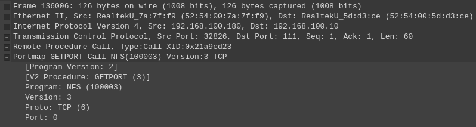
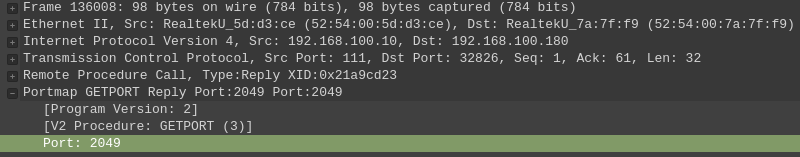
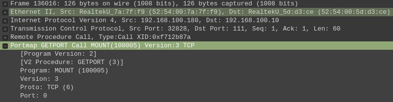
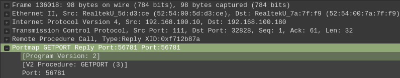
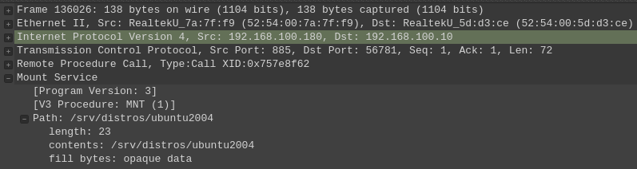
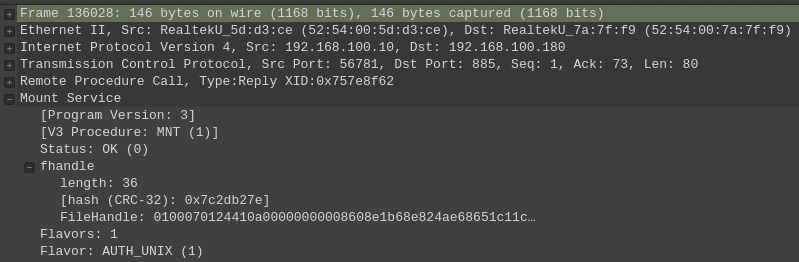

# Sumário

[toc]

[Introdução](#Introdução)
[NFS sobre TCP e UDP](#NFS-sobre-TCP-e-UDP)
[Remote Procedure Calls - RPC](#Remote-Procedure-Calls---RPC)
[State - Mudança da versão](#State---Mudança-da-versão)
[Exports - Mudança da versão](#Exports---Mudança-da-versão)
[Segurança](#Segurança)
[Desempenho na nova versão](#Desempenho-na-nova-versão)
[Funcionamento do NFS](#Funcionamento-do-NFS)
    [Comportamento notado](#Comportamento-notado)
[Arquivo exports](#Arquivo-exports)
[Daemons relacionados ao NFS](#Daemons-relacionados-ao-NFS)
    [RPCBIND](#RPCBIND)
    [Mountd](#Mountd)
    [NFSD](#NFSD)
[Acesso root e nobody](#Acesso-root-e-nobody)
[Resumo](#Resumo)
[Comandos](#Comandos)
    [exportfs](#exportfs)
    [showmount](#showmount)
    [rpcinfo](#rpcinfo)
    [NFSSTAT](#NFSSTAT)
[Melhorando o desempenho](#Melhorando-o-desempenho)


## **Introdução**

O NFS foi desenvolvido pela Sun Microsystem com o propósito de compartilhar diretórios na rede local. Seu funcionamento é cliente/servidor, tendo pacotes separados para cada um, um conjunto de pacotes para o Servidor e outro para o Cliente.


Vamos a uma rápida introdução dos pacotes:

| Pacotes           | Distro      | Descrição                                     |
| ----------------- | ----------- | --------------------------------------------- |
| nfs-common        | Debian like | Utilitário para o Cliente NFS.                |
| nfs-kernel-server | Debian like | Pacote para o Servidor NFS.                   |
| nfs-utils         | RedHat like | Utilitário para o Cliente NFS e Servidor NFS. |


## NFS sobre TCP e UDP

Inicialmente o NFS foi desenvolvido para trabalhar em cima do UDP, porque ele tinha o melhor desempenho nas Redes e nos Servidores daquela época (estamos falando do NFS versão 2), o NFS por esse motivo (trabalhar com UDP) fazia remontagem da sequência dos pacotes e verificação de erros (já que o UDP não faz), mas ainda fica de fora algo muito importante, controle de congestionamento, é essencial para o bom desempenho de redes IP de grande porte (nem UDP nem NFS fazem isso). Na versão 3 do NFS, podemos escolher entre TCP ou UDP, e na versão 4 do NFS, temos somente o uso do TCP.

O NFS versão 4 requer TCP como protocolo padrão de transporte e se comunica na porta 2049. Já as versões anteriores podem ter sua porta modificada, assim como o protocolo de transporte. 

Por padrão, o NFS sempre vai preferir o TCP, mas para versão 2 e 3, onde temos o uso do rpcbind (antigo *portmap*), a comunicação com o *rpcbind* e com o *mountd* é feita infelizmente usando UDP.

Rpcbind é realizado na porta 111 e mountd uma porta aleatória por padrão mas você pode mudar ela, vou descrever isso em mais detalhes no decorrer do documento.


## Remote Procedure Calls - RPC

Durante o desenvolvimento do NFS, a equipe de desenvolvimento percebeu que muitos dos problemas relacionados à rede no projeto, que precisavam ser resolvidos para que o NFS funcionasse se aplicavam também à outros serviços baseados em rede. Com isso em mente, eles desenvolveram um método para *chamadas de procedimento remoto* conhecido como RPC. Dessa forma eles resolveriam o problema do NFS e de muitos outros serviços baseados em rede, o RPC abriu as portas para que aplicativos de todos os tipos pudessem executar procedimentos em sistemas remotos como se estivessem sendo executados localmente.

As operações que leem/gravam arquivos, montam sistemas de arquivos, acessam metadados de arquivos e verificam permissões de arquivos são implementadas como RPCs.

Alguns exemplos encontrados são:

- rpc.mountd

  Usado para montar o compartilhamento.

- rpcbind (antigo *portmap*)

  Usado para fazer o bind entre as portas do NFS server e Mountd, para que o cliente possa se comunicar com os protocolos corretos nos momentos certos.

- rpc.gssd

  Usado para implementar uma camada de segurança centralizada.


## State - Mudança da versão

As versões 2 e 3 do NFS não trabalham com *estado*, assim o servidor não controla quais clientes montaram um determinado compartilhamento. Para contornar isso, o servidor NFS envia um cookie na conclusão de uma montagem bem-sucedida. Esse cookie identifica o diretório montado para o servidor NFS, dessa forma temos uma maneira para o cliente acessar seu conteúdo. Os cookies persistem entre as reinicializações do servidor, portanto, uma falha não deixa com que o cliente fique num estado irrecuperável. O cliente pode simplesmente esperar até que o servidor esteja disponível novamente e reenviar a solicitação.
Já na versão 4 do NFS, o mesmo passou a ser um protocolo com monitoração de estado (tanto o cliente quanto o servidor mantêm informações sobre arquivos abertos e bloqueios). Se uma falha acontecer no servidor, os clientes vão auxiliar o servidor no processo de recuperação, enviando ao servidor suas informações de estado antes da falha ocorrer. Um servidor de retorno espera por um período predefinido para que os clientes anteriores relatem suas informações de estado antes de permitir novas operações e bloqueios. 

O uso de cookies não existe mais na versão 4 do NFS.


## Exports - Mudança da versão

Nas versões 2 e 3 do NFS, cada exportação é tratada como uma exportação independente, é exportada separadamente independente do diretório (exportar o **/var/log/** significa que voce vai exportar apenas ele e nada mais; tudo o que tiver dentro dele também). Na versão 4, um servidor exporta um único *Pseudo-File_System* que incorpora todos os seus diretórios exportados.

Em resumo, o Pseudo-File_System é um namespace do sistema de arquivos do servidor que remove qualquer coisa dentro do diretório raiz do Pseudo-File_System (sim, o Pseudo-File_System possui um diretório raiz) que não tenha sido previamente exportado.

| Diretórios      | Exportado? |
| --------------- | ---------- |
| **/var/log/**   | Sim        |
| /var/backups/   | Não        |
| /var/crash/     | Não        |
| **/var/cache/** | Sim        |
| /var/lib/       | Não        |
| **/etc**        | Sim        |
| /var/lock/      | Não        |
| **/var/www/**   | Sim        |

No NFS versão 3, cada diretório exportado deve ser configurado separadamente no cliente, no nosso caso, teriamos que montar 3 diretórios. No NFS versão 4, o pseudo-filesystem agrupa todo os diretórios no diretório raiz do pseudo-filesystem. Esse pseudo-filesystem segue por padrão a estrutura do FHS, ao invés vez de solicitarmos várias montagens separada para cada um dos diretórios **/var/www**, **/var/cache**, **/var/log** e **/etc**, o cliente agora pode montar todos os diretórios usando o pseudo-filesystem-raiz do servidor e navegar na hierarquia semelhante ao FHS.

Vamos ao exemplo prático:

- Exports feitos no servidor

  ```bash
  root@ServerNFS:~\# exportfs
  /var/log      	192.168.122.0/24
  /var/cache    	192.168.122.0/24
  /var/www      	192.168.122.0/24
  /etc          	192.168.122.0/24
  ```

- Já no cliente, podemos montar apenas o diretórios raiz:

  ```bash
  # Montando a raiz "/" do pseudo-filesystem:
  $ sudo mount 192.168.122.137:/ /mnt
  
  # Agora verifique o que temos la dentro:
  $ ls /mnt/
  etc  var
  
  $ ls /mnt/var/
  cache  log  www
  ```

  Como pode ver, ele tem apenas os diretórios que foram exportados pelo servidor, mesmo que tenhamos montado o **/** do servidor (pseudo-filesystem). Para mudar a raiz do pseudo-filesystem, use a opção **fsid=0** no compartilhamento que deseja tornar a raiz.

De acordo com Nemeth, Snyder, Hein Trent, Whaley e Mackin (2017, p. 797).

> Os clientes NFSv4 puros não podem examinar a lista de montagens em um servidor remoto. Em vez disso, eles simplesmente montam a pseudo-raiz e, em seguida, todas as exportações disponíveis tornam-se acessíveis por meio desse ponto de montagem.
>
> Essa é a história de acordo com as especificações RFC. Na prática, a situação é um tanto confusa. A implementação do Solaris está em conformidade com esta especificação. O Linux fez uma tentativa indiferente de oferecer suporte ao pseudo-sistema de arquivos no código NFSv4 anterior, mas posteriormente o revisou para suportar o esquema de forma mais completa; a versão de hoje parece respeitar a intenção da RFC. 
>
> O FreeBSD não implementa o pseudo-sistema de arquivos conforme descrito pela RFC. A semântica de exportação do FreeBSD é essencialmente a mesma da versão 3; todos os subdiretórios em uma exportação estão disponíveis para os clientes.


## Segurança

O protocolo NFS originalmente foi projetado sem nenhuma preocupação com a segurança dos exports.

A versão 4 do NFS abordou questões de segurança de versões anteriores, todas as versões do protocolo NFS são independentes do mecanismo de segurança, alguns dos métodos de segurança incluem:

| Mecanismo  | Descrição                                                    |
| ---------- | ------------------------------------------------------------ |
| AUTH_NONE  | Sem autenticação.                                            |
| AUTH_SYS   | Controle de acesso de usuário e grupo no estilo UNIX (Padrão para muitos ambientes). |
| RPCSEC_GSS | Utiliza uma autenticação centralizada como LDAP e Kerbero.   |

O método de segurança mais comum usado é o AUTH_SYS, tanto no passado como hoje em dia, ele depende dos identificadores de usuário e grupo UNIX (UID e GID). Aqui, o cliente envia o UID e o GID local do usuário que está solicitando acesso ao arquivo/diretório, o servidor então vai comparar os valores com aqueles de seu próprio arquivo **/etc/passwd** e determina se o usuário deve ter acesso. 

> Se os usuários *joão* e *rodrigo* tiverem o mesmo UID em dois clientes diferentes (joao tem uid 1003 no servidor e rodrigo tem uid 1003 no cliente), eles terão acesso aos arquivos um do outro.
>
> Esse problema acontece mais em ambientes onde a Home do usuário é compartilhada via rede.
>
> Além disso, os usuários que possuem acesso root em um sistema podem usar o comando *su* para obter qualquer UID que desejarem; o servidor então dará a eles acesso aos arquivos do usuário correspondente.
>
> Só que não, uma técnica foi implementada por poadrão, mas isso pode ser quebrado.

Para evitar todos esses problemas, a maioria dos servidores podem usar um método de segurança mais forte, como o Kerberos, em combinação com o RPCSEC_GSS. Essa configuração requer que o cliente e o servidor participem de um domínio Kerberos. Como o Kerberos (Assim como LDAP) autentica os usuários centralmente, dessa forma evitamos os problemas de auto-identificação descritos acima. O Kerberos também pode fornecer criptografia forte e integridade garantida para arquivos transferidos pela rede. Todos os sistemas NFS versão 4 em conformidade com o protocolo devem implementar RPCSEC_GSS, mas é opcional na versão 3.


## Desempenho na nova versão 

O NFS versão 4 foi projetado para ter seu desempenho melhorado em comparação com a versão 3:

- Na versão 3 temos uma série de requisições para rpcbind (antigo portmap), para o mountd e também para o NFS, isso aumenta a quantidade de pacotes na rede sem falar na dependencia de vários protocolos funcionando separadamente.

- Na versão 4 foi introduzido um RPC chamado COMPOUND que agrupa várias operações em uma solicitação, reduzindo a sobrecarga e a latência decorrentes de várias chamadas de procedimento remoto (como acontecia na versão 3), apesar de não utilizar rpcbind e mountd como na versão 3, ele ainda é usado na versão 4, acontece que agora não vemos mais os pacotes de comunicação ao fazer a captura de pacotes na rede. Mas se você desabilitar os daemons do *rpcbind* e  *nfs-mountd*, verá que não será possível montar nenhum diretório, tudo indicar que o uso desses RPCs são internos do NFS, mas eu não posso afimar, a única coisa que posso dizer é que NFS versão 4 não funciona sem eles estarem ativos.

Esses recursos descrito acima é o funcionamento do protocolo NFS nas camadas mais baixas, por isso não requerem muita atenção dos administradores do sistema, já que não temos muito como atuar nessa parte, mas é bom conhecer.


## Funcionamento do NFS

O servidor NFS "exporta" o diretório para a máquina cliente, isso acontece assim que o cliente monta o diretório remoto como se fosse um diretório local. 

Na NFS versão 3, o processo usado pelos clientes para montar um sistema de arquivos é separado do processo usado para acessar os arquivos. 

Primeiro o cliente faz um triple-way handshake (aperto de mãos) com o servidor (já que ele usa TCP para comunicação com o protocolo NFS).


Após estabelecido comunicação entre cliente e servidor (IP do servidor=192.168.10.10 e IP do cliente=192.168.10.180), o cliente vai enviar uma requisição GETPORT na porta 111 (novo rpcbind, antigo portmap), solicitando a porta usada pelo NFS:



E o servidor responde com a porta usada pelo NFS, no nosso caso, a porta 2049 (porta padrão):



> As comunicações com a porta 2049 são feitas preferencialmente via TCP na versão 3, na versão 4 é somente TCP.
>
> 
>
> Foquemos na versão 3 agora.
>
> As comunicações na porta 111 (*rpcbind*) vão depender do tipo de consulta do cliente.
>
> Caso o cliente não escolha um protocolo de transporte, a consulta que é realizada no *rpcbind* (GETPORT) para descobrir a porta do NFS é TCP (não entendi o  motivo, você verá o porque). 
> As mesmas consultas GETPORT que são feitas no *rpcbind* (feitas anteriormente em TCP para NFS) agora são feita usando UDP para descobrir a porta usada pelo *mountd*... 
> Consequentemente, as consultas realizada diretamente a *mountd* também são UDP (fácil de entender o porque).
>
> Caso o cliente escolha o protocolo de transporte como sendo TCP, todas as requisições para *rpcbind* e *mountd* vão ser feitas somente em TCP e caso tenha escolhido UDP, tudo será feito com UDP (funcionamento esperado).
>
> Isso deixa claro uma coisa, o cliente tem o poder de escolher qual protocolo de transporte será usado (isso se estiver habilitado no servidor).
>
> 
>
> Resumo:
>
> Preferencialmente o protocolo (*rpcbind*) escolhe comunicações UDP, não sendo possível alterar somente para TCP no daemon do *rpcbind*, mas o cliente pode alterar esse comportamento, portanto, você pode notar requisições para *rpcbind* (porta 111) sendo UDP ou TCP, fique ciente que isso depende do cliente escolher usar TCP, se não escolher, será usado UDP (só não será usado UDP na comunicação para saber a porta do NFS).

Depois disso, uma série de comunicações é feita entre cliente e servidor através do *rpcbind*. Agora nosso cliente envia uma requisição para o servidor na porta 111 (rpcbind) solicitando a porta que está sendo usada pelo mountd (também conhecido como *rpc.mountd*):

> *mountd* (rpc.mountd) roda em portas aleatorias por padrão (isso pode ser alterado), é responsabilidade do *rpcbind* dizer ao cliente qual porta deve ser usada para comunicação com *mountd*. 
>
> A função do *mountd* é fazer a montagem dos diretorios remotos.



Após o servidor receber a consulta, ele responde com a porta usada pelo *mountd* (porta 56781 no nosso caso):



Agora uma série de comunicações será feita com *rpcbind* novamente, e depois disso, uma comunicação com *mountd* é realizada, nessa comunicação o cliente informa qual diretório gostaria de montar em seu sistema:



> O cliente quer montar o diretório /srv/distros/ubuntu2004

Se tudo der certo, o servidor responde positivamente (**Status: OK (0)**):



Depois disso outra série de comunicações é feita entre cliente e servidor para finalizar a montagem do diretório, a comunicação final tem andamento na porta 2049 (protocolo do nfs, também conhecido como NFSD), aqui você já deve ter o diretorio pronto para uso.

Na versão 4 as exportações são apresentadas aos clientes como uma única hierarquia de sistema de arquivos por meio do pseudo-filesystem, já explicado em **Exports - Mudança da versão 3 para 4**. Com sobre o funcionamento da comunicação na versão 4 não tem muito segredo, o diferencial é que o uso do *rpcbind* e *mountd* não são mais necessários, o cliente abre apenas 1 comunicação com o servidor usando a chamada COMPOUND que fará tudo que for necessário para montar o filesystem do NFS, essas chamadas são realizadas na porta 2049 (onde roda o daemon do NFSD).


### Comportamento notado

Existem algumas observações que eu pude notar com o uso do NFS, ainda mais quando eu tive a incrível ideia de forçar ele a usar somente a versão 4, isso ainda vai ser falado mais para frente, mas quis dedicar esse espaço para essas observações.

Por padrão tanto cliente como servidor vão usar o NFS versão 4, desde que algumas coisas não aconteçam.

Se você mudar a porta do NFS (padrão 2049), o cliente vai tentar comunicação nessa porta e então vai falhar, com isso ele faz um GETPORT no rpcbind diretamente, aqui ja vemos que começou a usar NFS versão 3.

Eu tentei inclusive fazer um redirecionamento de porta, para tentar enganar o sistema, mas por algum motivo ele sabe e passar a usar o rpcbind, com isso, ele acaba usando NFS versão 3 (talvez eu não tenha feito direito).

Se voce desativar rpcbind e nfs-mountd, o NFS não vai funcioanar, independente da versão, muitos publicadores de conteúdo dizem que você deve desativar versões anteriores do NFS se não for usar, e ficar preferencialmente com NFS versão 4, mas o que eu pude notar é que ele usa internamente RPC ainda, mesmo que isso não fique visível para nós, digo isso porque após desativar rpcbind e nfs-mountd e forçar o NFS a usar a versão 4, ele funcionará.


## Arquivo exports

O NFS usa um único banco de dados de controle de acesso que informa quais diretórios devem ser exportados e quem podem montá-los.

O arquivo responsável por manter os dados de acesso (diretórios a serem exportados e quem pode acessar) fica em **/etc/exports**. Esse arquivo é lido pelo comando `exportfs -a` no Linux e vai ser lido ao reiniciar o serviço do NFS no FreeBSD. 

Ao editar **/etc/exports**, execute `exportfs -ra` para ativar suas mudanças no Linux ou execute `service nfsd restart` no FreeBSD. Segue uma tabela contendo os comandos e suas descrições.

| Comando                | Sistema       | Descrição                                                    |
| ---------------------- | ------------- | ------------------------------------------------------------ |
| exportfs -ra           | Linux         | Re-exporta todos os diretórios no arquivo.                   |
| service mountd reload  | FreeBSD/Linux | Reinicia o daemon do mountd.                                 |
| service rpcbind reload | FreeBSD/Linux | Reinicia o daemon do rpcbind.                                |
| service nfsd reload    | FreeBSD/Linux | Reinicia o daemon do rpcbind e faz a re-leitura do arquivo de exportação. |

Em ambientes Linux com Systemd é recomendado o uso  `systemctl restart serviço`.

O arquivo de exportação consiste em uma lista de diretórios exportados seguido pelos hosts que têm permissão para acessá-los e opções associadas ao ponto de montagem/funcionamento do NFS. Um espaço em branco deve separar o diretório a ser exportado da lista de clientes, podemos ter mais de um cliente liberado para acesso, cada cliente é seguido imediatamente por uma lista de opções separadas por vírgulas entre parênteses.

Por exemplo, estou exportando o `/home`, para todos que estão na rede `192.168.122.0/24`:

`/home 192.168.122.0/24(ro)`

Nesse caso, eles só terão acesso a leitura `ro (Read-Only)`. Podemos usar o asterisco `*` onde deveriamos colocar o IP para especificar qualquer destino: `/home *(ro)`.


## Daemons relacionados ao NFS

Vou apresentar uma breve descrição sobre os daemons usados na comunicação do NFS, o foco aqui é mais para a versão 3, já que a versão 4 só temos o uso do `nfsd`.


### RPCBIND

O funcionamento desse daemon foi explicado em **Funcionamento do NFS**, mas numa rápida introdução.
Antigamente era chamado de `portmap`, ainda hoje é possível ver logs e registros usando esse nome, como o Wireshark, roda na porta 111, ele server para informar ao cliente NFS a porta que o protocolo /daemon do NFS/mountd estão usando, dessa forma, o cliente sabe em qual porta se conectar.

Seu arquivo de configuração fica em `/etc/default/rpcbind`, mas pode ser usado um outro arquivo, localizado em `/etc/rppcbind.conf` (normalmente esse segundo arquivo não existe, tendo somente o primeiro arquivo).

O script que inicia o *rpcbind*, que é executado pelo seu daemon fica em `/sbin/rpcbind`. Não existem muitas opções flexíveis para trabalharmos, mas dê uma olhada você mesmo, pode achar algo interessante, rode `man rpcbind`.


### Mountd

No Linux o daemon do *mountd* chama-se `nfs-mountd.service`, *mountd* não possui um arquivo de configuração, ele usa opções passadas como argumento ao script, essas opções podem ser colocadas num arquivo que foi criado com esse propósito. Ao reiniciar o daemon do *nfsd*, as configurações do *mountd* também são carregadas, isso porque no daemon do *nfsd* está configurado para ter esse comportamento, por isso, muitas vezes só precisamos reiniciar o *nfsd* (mountd acabará sendo reiniciado também).

Seu script fica em `/usr/sbin/rpc.mountd`. Como mountd roda em portas aleatórias, isso cria uma dificuldade para gerenciar todas as portas no firewall, por isso vamos ver como alterar/fixar sempre a mesma porta.
Acesse o arquivo `/etc/default/nfs-kernel-server`, nesse arquivo vai ter uma variável usada pelo daemon do *mountd*, chamada `RPCMOUNTDOPTS`, para fixar uma porta use a opção `--port <porta>`, no final dessa seção, vou mostrar um arquivo básico padrão que você deve ter para facilitar a implementação com firewall.


### NFSD

No Linux o *nfsd* não tem arquivo de configuração, assim como *mountd*, usa opções passadas como argumentos de linha de comando, inclusive, utilizam o mesmo arquivo `/etc/default/nfs-kernel-server`. 

Por padrão o *nfsd* recebe um argumento numérico `8`, isso especifica quantos threads de servidor bifurcar. Selecionar o número apropriado de *threads nfsd* é muito importante, se o número for muito baixo ou muito alto, o desempenho do NFS pode ser prejudicado.

O número ideal das threads vai depender do S.O. que vamos usar bem como do hardware. Se você notar que o comando `ps` geralmente mostra o *nfsd* no estado **D** (ininterrupto hibernação) e que alguma CPU ociosa está disponível, considere aumentar o número de threads. 
Se você encontrar a média de carga (conforme relatado pelo tempo de atividade) aumentando à medida que adiciona mais threads, você passou do limite, então deve diminuir a quantidade de threads.

Execute o **nfsstat** regularmente para verificar os problemas de desempenho que podem estar associados ao número de threads do *nfsd*.

No FreeBSD, as opções **--minthreads** e **--maxthreads** permitem especificar o número de threads, usando um limite mínimo e máximo.

A variável usada pelo *nfsd* é chamada `RPCNFSDARGS`, no arquivo onde configuramos esses parametros (para deixar permanente) ela tem o nome de `RPCNFSDCOUNT`, tudo o que estiver nessa variável será importada para a variável `RPCNFSDARGS`. Seu script fica em `/usr/sbin/rpc.nfsd` e seu daemon chama-se `nfs-kernel-server` e tem um alias chamado `nfs-server` (para facilitar as coisas 🙂).

Em ambientes RedHat o arquivo `nfs-kernel-server` fica em `/etc/sysconfig/nfs`.


## Acesso root e nobody

Essa seção se aplica a ambientes que usem *AUTH_SYS* preferencialmente. Os usuários devem sempre receber privilégios idênticos onde quer que vão o mesmo usuário em duas máquinas diferentes devem ter o mesmo acesso (normalmente, você já vai entender),  é importante evitar que o root seja executado excessivamente em sistemas de arquivos montados em NFS, isso porque um usuário com root no sistema remoto poderia ter acesso as arquivos de outros usuários, do qual ele não deveria ter esse acesso.

Um exemplo disso é quando usamos a home dos usuários montados via rede, é importante evitar que o root possa acessar o conteúdo da home dos usuários do NFS. Por padrão, o servidor NFS intercepta as solicitações feitas que tenham o UID 0 e as altera para que pareçam ter vindo de outro usuário, essa técnica é chamada de "squashing root".

Uma conta reservada chamada "nobody" é definida especificamente para ser o pseudo-usuário, ou seja, o usuário root ao tentar acesso é mapeado para o usuário *nobody*, que possui o UID 65.534. 

É possível alterar os mapeamentos UID e GID padrão para root no arquivo de exportação. Alguns sistemas têm uma opção all_squash para mapear todos os UIDs do cliente para o mesmo UID de pseudo-usuário no servidor, isso significa que todos os usuário vão ser interpretados sendo o usuário *nobody*, muito recomendado para ambientes publicos.

Que fique claro, esse método é usado para impedir que o root acesse arquivos de outros usuário, apenas isso, pode parecer pouco ou insignificante para a maioria dos ambientes que usam NFS, mas esse técnica é muito importante. O único efeito aceitável da destruição do squashing root é permitir o acesso do root aos arquivos que pertencem ao root, fazendo isso você devolve o poder do root para ele, cuidado com isso, se você for mesmo root, provavelmente terá acesso ao servidor, então acho díficil uma justificativa para destruir squashing root.

Para desativar *root_swash*, defina a opção **no_root_squash**. 


Opções gerais usadas no exports:

| Opção                | Descrição                                                    |
| -------------------- | ------------------------------------------------------------ |
| secure               | Esta opção requer que as solicitações sejam originadas em uma porta da Internet menor que IPPORT_RESERVED (1024). <br />Essa opção está ativada por padrão. Para desligá-lo, especifique Insecure.<br />Ao capturar pacotes de NFS, você pode verificar que as requisições do cliente sempre saem de portas abaixo de 1024, tornando essa regra verdadeira, na Internet, essas portas tem usos especificos. |
| rw                   | Permite leitura e gravação em volumes NFS. O padrão é proibir qualquer solicitação que mude o sistema de arquivos, igual a  **ro**. |
| async                | Esta opção permite que o servidor NFS viole o protocolo NFS e responda às solicitações antes que quaisquer alterações feitas por essa solicitação sejam confirmadas para armazenamento estável (por exemplo, unidade de disco).<br/><br/>Usar essa opção geralmente melhora o desempenho, mas ao custo de uma reinicialização do servidor impura (ou seja, uma falha) pode fazer com que os dados sejam perdidos ou corrompidos. |
| sync                 | Responda às solicitações somente depois que as alterações forem confirmadas para armazenamento estável.<br/><br/>Em versões de nfs-utils até e incluindo 1.0.0, a opção async era o padrão. Em todas as versões posteriores a 1.0.0, a sincronização é o padrão e async deve ser solicitado explicitamente, se necessário. <br/><br/>Para ajudar a tornar os administradores do sistema cientes desta mudança, exportfs irá emitir um aviso se nem sync nem async forem especificados.<br /><br />O uso dessa opção teoricamente, piora o desempenho, nada que seja notável nos dias de hoje, graças ao poder dos hardwares atuais, mas com essa opção, temos uma maior garantia e confiabildiade dos dados. |
| no_subtree_check     |                                                              |
| fsid=num\|root\|uuid | O NFS precisa ser capaz de identificar cada sistema de arquivos que exporta.  Como nem todos os sistemas de arquivos são armazenados em dispositivos, e nem todos os sistemas de arquivos têm UUIDs, às vezes é necessário dizer explicitamente ao NFS como identificar um sistema de arquivos.<br />Para NFSv4, há um sistema de arquivos distinto que é a raiz de todos os sistemas de arquivos exportados. Isso é especificado com `fsid=root` ou `fsid=0`, ambos significando exatamente a mesma coisa. |
| root_squash          | Mapeie as solicitações de uid/gid 0 para o uid/gid anônimo.<br /><br />Observe que isso não se aplica a quaisquer outros uids ou gids que possam ser igualmente sensíveis, como compartimento de usuário ou equipe de grupo. |
| no_root_squash       | Desligue o squashing root.                                   |
| all_squash           | Mapeie todos os uids e gids para o usuário anônimo/nobody. Útil para diretórios FTP públicos exportados por NFS, diretórios de spool de notícias, etc. A opção oposta é no_all_squash, que é a configuração padrão usada na opção *sec*. |
| anonuid e anongid    | Essas opções definem explicitamente o uid e o gid da conta anônima. Esta opção é útil principalmente para clientes PC/NFS, onde você pode desejar que todas as solicitações pareçam ser de um usuário. |

**no_subtree_check**

Cemo a descrição dessa opção é grande no manual, ela não cabe na tabela acima, então vou deixar a explicação abaixo:

> Esta opção desativa a verificação de subárvore, o que tem implicações de segurança leves, mas pode melhorar a confiabilidade em algumas circunstâncias.
>
> Se um subdiretório de um sistema de arquivos é exportado, mas todo o sistema de arquivos não é, sempre que uma solicitação NFS chega, o servidor deve verificar não apenas se o arquivo acessado está no sistema de arquivos apropriado (o que é fácil), mas também se está no árvore exportada (o que é mais difícil). Essa verificação é chamada de subtree_check.
>
> Para realizar esta verificação, o servidor deve incluir algumas informações sobre a localização do arquivo no "identificador de arquivos" que é fornecido ao cliente. Isso pode causar problemas ao acessar arquivos que são renomeados enquanto um cliente os mantém abertos (embora em muitos casos simples ainda funcione).
>
> A verificação de subárvore também é usada para certificar-se de que os arquivos dentro de diretórios aos quais apenas o root tem acesso podem ser acessados apenas se o sistema de arquivos for exportado com no_root_squash, mesmo se o próprio arquivo permitir um acesso mais geral.
>
> Como um guia geral, um sistema de arquivos de diretório pessoal, que normalmente é exportado na raiz e pode ter muitas renomeações de arquivos, deve ser exportado com a verificação de subárvore desabilitada. Um sistema de arquivos que é principalmente somente leitura, e pelo menos não vê muitos arquivos renomeados (por exemplo, /usr ou /var) e para o qual subdiretórios podem ser exportados, provavelmente deve ser exportado com verificações de subárvore habilitadas.
>
> A partir da versão 1.1.0 do nfs-utils, o padrão será no_subtree_check já que subtree_checking tende a causar mais problemas do que vale a pena. Se você realmente precisa da verificação de subárvore, deve colocar explicitamente essa opção no arquivo de exportação. Se você não colocar nenhuma opção, exportfs irá avisá-lo de que a mudança está pendente.


## Resumo

Agora que já conhecemos bem o funcionamento do NFS (embora o conteúdo desse documento não aborde métodos avançados de uso dele), temos uma base sólida para usar tal protocolo. 

Sempre que quisermos exportar algum diretório, o mesmo deve estar em `/etc/exports`, exemplo:

```bash
/var/log/ 192.168.122.0/24(rw,sync,no_subtree_check)
# Aqui estou exportando o /var/log.
```


Para configurarmos portas específicas a serem usadas por *mountd* (lembre que ele usa várias portas aleatórias, dificultando o uso com firewalls), a porta deve ser fixada no arquivo `/etc/default/nfs-kernel-server` para ambientes Debian e `/etc/sysconfig/nfs` para Redhat.

Segue um exemplo de meu arquivo:

```bash
# Number of servers to start up
RPCNFSDCOUNT="8"

# Runtime priority of server (see nice(1))
RPCNFSDPRIORITY=0

# Options for rpc.mountd.
# If you have a port-based firewall, you might want to set up
# a fixed port here using the --port option. For more information, 
# see rpc.mountd(8) or http://wiki.debian.org/SecuringNFS
# To disable NFSv4 on the server, specify '--no-nfs-version 4' here
RPCMOUNTDOPTS="--manage-gids --port 37240"

# Do you want to start the svcgssd daemon? It is only required for Kerberos
# exports. Valid alternatives are "yes" and "no"; the default is "no".
NEED_SVCGSSD=""

# Options for rpc.svcgssd.
RPCSVCGSSDOPTS=""
```

Lembre-se que para configurar qualquer coisa para o NFS em sí (nfsd) usamos a variável `RPCNFSDCOUNT`, que nesse caso possui o número de threads que o servidor vai usar.

E para configurar qualquer coisa para *mountd*, usamos a variável `RPCMOUNTDOPTS`, que nesse caso, estamos informando a porta que ele irá usar, `manage-gids` faz com que sejam aceitados as solicitações do kernel para mapear números de id de usuário em listas de números de id de grupo para uso no controle de acesso.


## Comandos

Vamos ver alguns comandos que vão nos ajudar no dia a dia.


### exportfs

Usado para fazer manutenção na tabela de filesystems exportados do NFS (edita os diretórios exportados).

As opções mais usadas são:

| Opção       | Descrição                                                    |
| ----------- | ------------------------------------------------------------ |
| -d          | Ativa o Debug                                                |
| -a          | Esporta tudo o que estiver no arquivo de exports.            |
| -o <opções> | Informa as opções que são fornecidas no arquivo de exports.  |
| -r          | Re-exporta tudo.                                             |
| -u          | Se usado sozinho não surte efeito, precisa ser usado com a opção `-a` (all) ou informar o diretório que gostaria de parar de exportar. |
| -v          | Ativa o verbose quando for exportar ou defazer o exporte.    |
| -s          | Exibe os diretórios que foram exportados, com detalhes das opções usadas. |

Embora possamos exportar os diretórios no exports, também podemos exportar um diretório temporariamente, para isso usamos a sintaxe `exportfs IP:folder -o options`, veja um exemplo:

```bash
exportfs 192.168.0.0/24:/var/log -o ro,sync,no_subtree_check
```


### showmount

Usado para verificar os diretórios que foram exportados, `exportfs` já faz isso, mas possui opções que não tem nele.

| Opção | Descrição                                                    |
| ----- | ------------------------------------------------------------ |
| -e    | Mostra os diretórios exportados.                             |
| -a    | Mostra quem e qual diretório foi montado, vai mostrar o hostname ou IP do cliente seguido do diretório que ele montou. |
| -d    | Mostra somente o diretório exportado que já foi montado por um cliente, mas só mostra o nome do diretório. |


### rpcinfo

Exibe informações do RPC.

A opção mais usada é a `-p`, onde exibe um resumo das versões ativas do NFS, mountd e rpcbind, quais portas eles estão usando e quais protocolos de transportes estão ativos.

```bash
root@NFServer:~# rpcinfo -p
   program vers proto   port  service
    100000    4   tcp    111  portmapper
    100000    3   tcp    111  portmapper
    100000    2   tcp    111  portmapper
    100000    4   udp    111  portmapper
    100000    3   udp    111  portmapper
    100000    2   udp    111  portmapper
    100005    1   udp   5600  mountd
    100005    1   tcp   5600  mountd
    100005    2   udp   5600  mountd
    100005    2   tcp   5600  mountd
    100005    3   udp   5600  mountd
    100005    3   tcp   5600  mountd
    100003    3   tcp   7000  nfs
    100003    4   tcp   7000  nfs
    100227    3   tcp   7000
    100003    3   udp   7000  nfs
    100227    3   udp   7000
    100021    1   udp  43950  nlockmgr
    100021    3   udp  43950  nlockmgr
    100021    4   udp  43950  nlockmgr
    100021    1   tcp  33751  nlockmgr
    100021    3   tcp  33751  nlockmgr
    100021    4   tcp  33751  nlockmgr
```


### NFSSTAT

Mostra estatística do NFS, é um comando bem complexo de se entender, possuí muita informações em sua saída, o recomendado é que se entenda sobre cada opção exibida (não vou focar nisso aqui).


## Melhorando o desempenho

