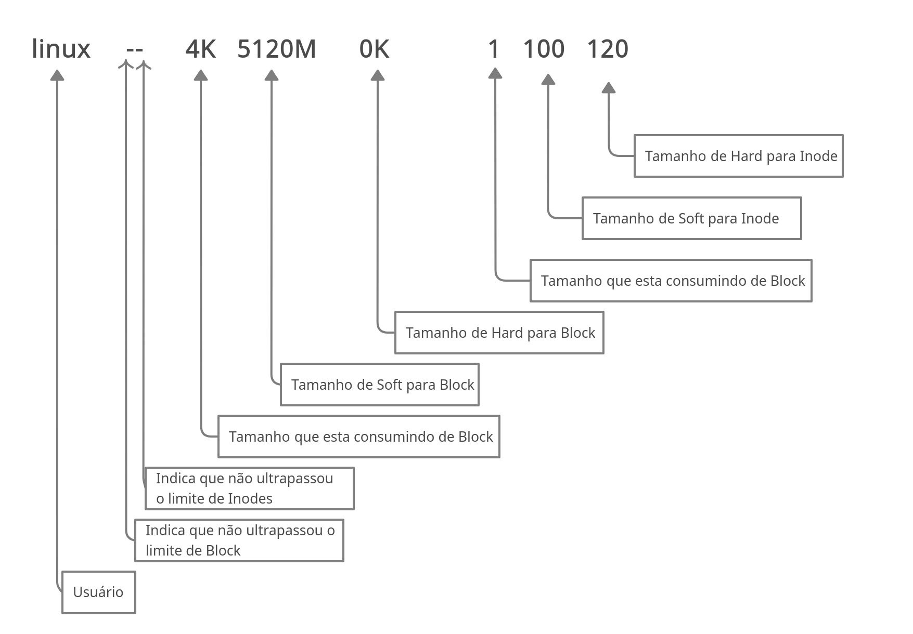

[toc]


## Introdução

As quotas de disco se aplicam diretamente ao usuário(s) e/ou grupo(s). O sistema de quota roda sob o FileSystem, para isso o FileSystem (toda a familia ext* da suporte ao gerencimento de quota) tem que dar suporte ao gerenciamento de quota. Com esse sistema podemos limitar o uso em disco ou a quantidade de inodes, que para facilitar pensamos como a quantidade de arquivos que podem ser criados.


O processo de implantação e gerenciamento e quota segue um processo bem simples:

1. Instalação do pacote.
2. Edição do `fstab`, colocando as flags necessárias na montagem do disco/partição.
3. Criar os arquivos de controle dentro do FielSystem (precisa aplicar as devidas permissões).
4. Ativar o sistema de quota.
5. Definir a quantidade de quota de disco, arquivos ou ambos para cada usuário, grupo ou ambos que vão estar sobre esse gerencimento.
6. Executar verificações periódicas. 


### Instalação

Em ambientes Debian o pacote é denominado `quota`, em ambientes Redhat também, mas lá temos também um pacote a mais denominado `quotatool`, como estou fazendo em ambiente Debian, vamos a instalação:

```bash
# Instalar o pacote quota:
sudo apt install -y quota

## Como nosso sistema vai rodar sobre outro disco, vamos colocar o FS no disco.

# Para um disco limpo, sem tabela de partição, vou definir a minha como MBR:
sudo parted /dev/vdb mklabel msdos

# Vamos criar uma partição contendo o disco inteiro:
echo -e "n\np\n1\n\n\nw" | sudo fdisk /dev/vdb

# Agora vamos colocar o FS no disco:
sudo mkfs.ext4 /dev/vdb1
```


Agora devemos colocar nossa partição no `fstab`, o filesystem devem ser montado com algumas flags específicas. A opção `usrquota` é para aplicar quota para usuário e `gprquota` para aplicar quota nos grupos.


Montando no `fstab`

```bash
# Vamos trabalhar com UUID dapartição, para isso pegue o UUID usando o comando:
sudo blkid

# No meu caso o UUID é 45301ed5-4722-4f60-a5fb-6f50d655d1d1.

# Editque o arquivo '/etc/fstab':
sudo vim /etc/fstab

# Adicione  alinha abaixo para seu FS/Partição/Disco:
UUID="45301ed5-4722-4f60-a5fb-6f50d655d1d1" /test_quota ext4 defaults,usrjquota=aquota.user,grpjquota=aquota.group,jqfmt=vfsv0 0 2

# Crie o diretório abaixo:
sudo mkdir /test_quota
```


### Arquivos de controles

Agora precisamos criar os arquivos de controle, são neles que ficam as informações de quota para usuários e grupos.

Existem 2 padrões para esses arquivos, sendo 2 para usuário e 2 para grupos, são eles:

- `quota.user` ou `aquota.user`

  Ambos usados para o usuário, porém, `quota.user` é o antigo padrão de arquivo de controle,  enquanto que `aquota.user` é o novo padrão.

- `quota.group` ou `aquota.group`

  Ambos usados para o grupo, porém, `quota.group` é o antigo padrão de arquivo de controle,  enquanto que `aquota.group` é o novo padrão.

O sistema vai escolher qual usar caso você coloque no `fstab` apenas `usrquota` e/ou `grpquota`, no nosso caso, definimos qual padrão usar para cada um dos arquivos de controle.

O `jqfmt=vfsv0` é o formato de quota usada quando `usrjquota` ou `grpquota` são especificados na flag do FielSystem.


Agora vamos criar os arquivos de controle com o comando `quotacheck`, além dessa nobre função, esse comando também é usado para verificar a situação das quotas do sistema.

```bash
# Criação dos arquivos de quota:
sudo quotacheck -mcug /test_quota/

# -m = Força a não remontagem do FS como Read-Only.
# -c = Cria os arquivos de controle, se já existir, vai sobrescrever (Cuidado).
# -v = Verbose.
# -u = Atua sobre a quota de usuário (é o padrão).
# -g = Atua sobre a quota de grupo.
```


### Ativando a quota

Para que o sistema de quota fique ativo, devemos ativar ele usando o comando `quotaon -av`, o `-a` é para todos os fielsystem no `fstab` que possuem as flags de quota, mas podemos especificar apenas o diretório que queremos ativar.

```bash
# Ativando o sistema de quota:
 sudo quotaon -av
/dev/vdb1 [/test_quota]: group quotas turned on
/dev/vdb1 [/test_quota]: user quotas turned on
```


### Grace time

Todos os usuários vão ter um quota para uso, muito conhecida como `soft blocks` para o caso de uso de disco e `soft inodes` para a quantidade de arquivos que podem criar.

Indenpente do tipo de quota, `soft` é nome dado para o limite que o usuário pode usar, quando ele ultrapassa esse limite, técnicamente não poderia mais escrever, porque atingiu sua quota, para que ele não fique incapacitado de trabalhar, é dado a ele mais um pouco de armazenamento, chamado `hard`, mas esse armazenamento tem tempo limite de vida, esse tempo é chamado `grace time`, normalmente é de 7 dias, mas você pode mudar isso.

Ao se esgotar o grace time e o usuário não voltar ao *soft limit*, ele será impossibilitado de escrever (criar novos arquivos) porque não terá mais espaço.


#### Alterando o Grace time

Para alterar o Grace time vamos usar o comando `edquota -t`.

Você deve usar os argumentos `-u` para alterar o GT de usuário, esse argumento é opcional porque ele é o padrão, caso você não o coloque será editado para usuário ou usar o argumento `-g` para alterar o GT de grupos.

Ao digitar esse comando, você será levado a um editor de texto onde deve mudar o GT (Grace time) para Block e Inode. 

A diferença é bem simples, Lembre-se que para simplificar, Inode é quantidade de arquivos que você pode criar.

> Digo simplificar porque cada arquivo no linux vai ter no mínimo 1 inode atrelado a ele, mas existem hard links, onde 2 arquivos compartilham o mesmo Inode, então nesse caso, você tem 2 arquivos mas somente 1 inode em uso.
>
> Por isso, simplificando, inode é igual a quantidade de arquivos.

Então você deve mudar o GT para Inode e para Block, esse tempo de cortesia vai ser usado quando o usuário ultrapassar os limites *soft*. Por padrão temos 7 dias, mas podemos escolher: segundos `seconds`, minutos `minutes`, horas `hours` e dias `days`.

Resumo:

`edquota -t` = Altera o Grace time para usuário, igual a `edquota -tu`.

`edquota -tg` = Altera o Grace time para grupo.


### Aplicando a quota para os usuários

Existem duas formas de aplicar a quota, uma com o comando `edquota` e outro com o comando `setquota`. O primeiro nos leva a um editor de texto onde poderemos alterar a quota do usuário ou grupo, já o segundo faz a edição automaticamente, bastando apenas informar os argumentos corretos (acredito que esse seja o mais utilizado pelos administradores).

Aqui temos a mesma linha de pensamento do *edquota* citado acima, caso use o argumento `-u` ou omita ele, será feito para usuário e para grupo você deve usar o argumento `-g`.

```bash
# Crie uma pasta para o usuário Linux:
sudo mkdir /test_quota/linux

# Altere as permissões para 750:
bruno@quota:~$ sudo chmod 750 /test_quota/linux/

# Mude o dono e grupo dono do arquivo para o linux:
bruno@quota:~$ sudo chown linux. /test_quota/linux/
```

Ao usar o comando `edquota -tu linux` por exemplo, você verá essas informações:

```
Filesystem    blocks     soft       hard     inodes   soft     hard
/dev/vdb1     4          0          0        1        0        0
```

Isso porque nesse Filesystem o usuário só tem 1 arquivo (a pasta dele, no linux tudo é um arquivo a nível de filesystem) e essa pasta consome 4K, veja abaixo:

```bash
sudo du -hs /test_quota/linux/
4.0K	/test_quota/linux/
```


Você não deve alterar as informações em `blocks` e `inodes`, isso é populado pelo proprio sistema, e não se preocupe em colocar as informações identadas certinho, o sistema fará isso ao salvar. Você só deve mudar o `soft` ou `hard`, seja o da esquerda, direita ou ambos.

Para alterar quota de consumo de espaço em disco, voce deve alterar da esquerda, ele é referente ao blocks, e para inode você deve alterar o da direita, ele é referente ao inodes.

Se você não quiser configurar algum deles basta deixar zerado, o usuário vai poder usar o quanto quiser, mas se colocar algum número lá, esse será o limite dele.


Com o uso do `setquota` a configuração é mais direta e rapida, veja a sintaxe do comando abaixo:

```bash
# Configurando quota para usuário:
setquota -u USUARIO SOFT_BLOCK HARD_BLOCK SOFT_LIMITS_FILE HARD_LIMITS_FILE HOME

# Configurando quota para grupo:
setquota -g GRUPO SOFT_BLOCK HARD_BLOCK SOFT_LIMITS_FILE HARD_LIMITS_FILE HOME

# Você pode usar o nome do usuário/grupo ou o UID/GID.
```


Vamos configurar uma quota de 5GB para o usuário linux.

Para saber qual número usar, use essa conta `5*1024^2`, no caso você deve alterar apenas o primeiro número, ele é a quantidade de Gigas que voce quer, no caso 5 gigas em Kilo Bytes.

```bash
# Aplicando 5GB de quota para o usuário linux, com limite hard de 6GB, para inode ele nao pode ultrapassar o limite hard de 120 inodes.
sudo setquota -u linux 5242880 6291456 100 120 /test_quota/
```


Veja a quota que aplicamos:

```bash
sudo repquota -uas | sed -n '3,4p; /linux/p'
                        Space limits                File limits
User            used    soft    hard  grace    used  soft  hard  grace
linux     --      4K   5120M   6144M              1   100   120

# -u = Verificar os usuários.
# -a = Verifica em todos os Filesystem.
# -s = Converte os valores para ficar facil de interpretar.
```

Segue uma imagem explicando cada campo do output do nosso comando:

Cado o indicador menos `-` explicado na imagem acima seja um `+`, isso significa que o usuário ultrapassou os limites soft, seja de block ou inode.


### Testando a quota

Vamos testar nossa quota, para isso siga os passos abaixo:

```bash
# Logue com o usuário Linux e entre na pasta que aplicamos a quota:
su linux 
cd /test_quota/linux/

# Agora rode o comando abaixo:
yes teste_de_escrita > lotar_quota.txt
yes: standard output: Disk quota exceeded

# O comando 'yes' vai ficar repetindo "teste_de_escrita" e jogar a saída no arquivo 'lotar_quota.txt', quando o disco lotar não será mais possível escrever nada, então o processo do comando 'yes' será eliminado.

# Ao terminar, verifique o tamanho do arquivo:
 du -hs lotar_quota.txt 
6.0G	lotar_quota.txt

# Perceba que atingiu o limite hard definido, se não fosse definido o limite hard o usuário poderia escrever até lotar o disco, o limite soft só notifica o usuário e os administradores, mas não impede a escrita, somente o hard faz isso.
```


Agora com outro usuário, com poderes de root, verifique os log da quota:

```bash
sudo repquota -uas | sed -n '3,4p; /linux/p'
                        Space limits                File limits
User            used    soft    hard  grace    used  soft  hard  grace
linux     +-   6144M   5120M   6144M  6days       2   100   120
# Veja o mais indicando que o usuário atingiu ultrapassou o limite soft.
```

> Se você só aplicar a quota Hard limit, deixando soft limit zerado, o usuário vai poder usar todo o espaço até atingir o limite Hard, mas quando ele atingir esse limit, o repquota não detectar que ele ultrapassou ou atingiu o limite, para isso você precisa especificar o Soft limit.


### Verificação periódica

Com o tempo entra e sai usuário, muda quota, por isso é bom fazer uma verificação periódica dos arquivos de quota, para isso usamos o comando `quotacheck`, note que para fazer uma verificação dessa a quota deve estar desabilitada.

```bash
# Desabilite a quota:
sudo quotaoff -a
## O '-a' é para todos os Filesystem.

# Faça a verificação:
sudo quotacheck -amivug

# -a = Todos os filesystem.
# -m = Não remontar como read-only.
# -i = Perguntas o que fazer caso encontre problema.
# -v = Verbose.
# -g = group.
# -u = user.

# Ative a quota novamente:
sudo quotaon -a
```


### Aplicando quota para grupos

Coloquei esse tópico aqui por ser algo importante e que pode fazer falta:

```bash
# Crie o grupo:
sudo addgroup atendimento

# Adicione um user no grupo:
sudo gpasswd -a linux atendimento

# Crie o diretório:
sudo mkdir /test_quota/atendimento

# Altere as permissões do diretório
sudo chmod 2770 /test_quota/atendimento

# Altere o grupo do diretório:
sudo chgrp atendimento /test_quota/atendimento

# Desative a quota:
sudo quotaoff -a

# Faça uma verificação:
sudo quotacheck -amivug

# Reative novamente:
sudo quotaon -a

# Aplique as quotas para o grupo:
sudo setquota -g atendimento 1048576 2097152 100 120 /test_quota/

# Verifique as quotas aplicadas para esse grupo:
sudo repquota -gas | sed -n '3,4p; /atendimento/p'
                        Space limits                File limits
Group           used    soft    hard  grace    used  soft  hard  grace
atendimento --      4K   1024M   2048M              1   100   120
```


### Notificação por email

O quota tem um utilitário chamado `warnquota` que faz o envio das notificações por email, para isso você só precisa ter qualquer MTA instalado (como Postfix, sendmail entre outros), por padrão ele vem com a configuração para funcionar com sendmail.

Você pode alterar a conf dele em `/etc/warnquota.conf`

